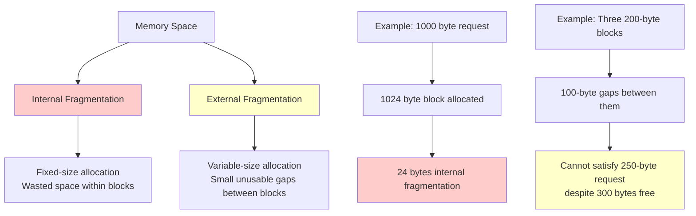

# Fragmentation

Fragmentation refers to the inefficient use of memory due to small, non-contiguous free blocks that cannot satisfy allocation requests. It's a critical issue in memory management systems.

## 🎯 Core Concepts

### What is Fragmentation?
- **Definition**: Wasted memory space that exists but cannot be used effectively
- **Impact**: Reduces effective memory utilization and system performance
- **Types**: Internal fragmentation and external fragmentation
- **Measurement**: Fragmentation ratio = Unusable memory / Total memory

### Memory Layout Visualization


## 🔴 Internal Fragmentation

### Definition and Causes
Internal fragmentation occurs when allocated memory blocks are larger than requested, resulting in wasted space within the allocated block.

### Common Scenarios
```c
// Example 1: Fixed-size page allocation
#define PAGE_SIZE 4096

typedef struct {
    void *base_address;
    size_t requested_size;
    size_t allocated_size;
    size_t internal_fragmentation;
} memory_block_t;

memory_block_t allocate_pages(size_t requested_size) {
    memory_block_t block;
    
    // Calculate number of pages needed
    size_t pages_needed = (requested_size + PAGE_SIZE - 1) / PAGE_SIZE;
    
    block.requested_size = requested_size;
    block.allocated_size = pages_needed * PAGE_SIZE;
    block.internal_fragmentation = block.allocated_size - requested_size;
    block.base_address = allocate_physical_pages(pages_needed);
    
    return block;
}

// Example: Request 3000 bytes
// Allocated: 4096 bytes (1 page)
// Internal fragmentation: 1096 bytes (26.7%)
```

### Internal Fragmentation in Different Systems

#### 1. Paging Systems
```c
typedef struct {
    uint32_t total_processes;
    uint32_t total_pages_allocated;
    uint64_t total_requested_memory;
    uint64_t total_allocated_memory;
    double internal_fragmentation_ratio;
} paging_fragmentation_stats_t;

void calculate_paging_fragmentation(paging_fragmentation_stats_t *stats) {
    uint64_t wasted_memory = stats->total_allocated_memory - stats->total_requested_memory;
    stats->internal_fragmentation_ratio = (double)wasted_memory / stats->total_allocated_memory;
    
    printf("Paging System Fragmentation Analysis:\n");
    printf("Total Allocated Memory: %lu bytes\n", stats->total_allocated_memory);
    printf("Total Requested Memory: %lu bytes\n", stats->total_requested_memory);
    printf("Wasted Memory: %lu bytes\n", wasted_memory);
    printf("Internal Fragmentation: %.2f%%\n", stats->internal_fragmentation_ratio * 100);
}

// Real-world example calculation
void example_paging_fragmentation() {
    paging_fragmentation_stats_t stats = {0};
    
    // Process 1: requests 3000 bytes, gets 4096 bytes (1 page)
    stats.total_requested_memory += 3000;
    stats.total_allocated_memory += 4096;
    
    // Process 2: requests 7500 bytes, gets 8192 bytes (2 pages)
    stats.total_requested_memory += 7500;
    stats.total_allocated_memory += 8192;
    
    // Process 3: requests 1000 bytes, gets 4096 bytes (1 page)
    stats.total_requested_memory += 1000;
    stats.total_allocated_memory += 4096;
    
    stats.total_processes = 3;
    stats.total_pages_allocated = 4;
    
    calculate_paging_fragmentation(&stats);
    // Result: ~27% internal fragmentation
}
```

#### 2. Buddy System
```c
typedef struct buddy_block {
    size_t size;
    bool is_free;
    struct buddy_block *next;
    struct buddy_block *buddy;
} buddy_block_t;

buddy_block_t* buddy_allocate(size_t requested_size) {
    // Find next power of 2 >= requested_size
    size_t block_size = next_power_of_2(requested_size);
    
    buddy_block_t *block = find_free_block(block_size);
    if (block == NULL) {
        block = split_larger_block(block_size);
    }
    
    if (block != NULL) {
        block->is_free = false;
        
        // Calculate internal fragmentation
        size_t internal_frag = block_size - requested_size;
        record_internal_fragmentation(internal_frag);
    }
    
    return block;
}

size_t next_power_of_2(size_t size) {
    size_t power = 1;
    while (power < size) {
        power <<= 1;
    }
    return power;
}

// Example: Request 100 bytes
// Allocated: 128 bytes (next power of 2)
// Internal fragmentation: 28 bytes (21.9%)
```

#### 3. Slab Allocation
```c
typedef struct slab {
    size_t object_size;
    uint32_t objects_per_slab;
    uint32_t free_objects;
    void *slab_memory;
    struct slab *next;
} slab_t;

typedef struct slab_cache {
    size_t object_size;
    slab_t *partial_slabs;
    slab_t *full_slabs;
    slab_t *empty_slabs;
    uint64_t total_internal_fragmentation;
} slab_cache_t;

void* slab_allocate(slab_cache_t *cache, size_t requested_size) {
    // In slab allocation, internal fragmentation occurs when
    // requested size < object size
    size_t internal_frag = 0;
    
    if (requested_size <= cache->object_size) {
        internal_frag = cache->object_size - requested_size;
        cache->total_internal_fragmentation += internal_frag;
    }
    
    return allocate_from_slab(cache);
}
```

## 🔵 External Fragmentation

### Definition and Causes
External fragmentation occurs when free memory exists but is divided into small, non-contiguous blocks that cannot satisfy allocation requests.

### External Fragmentation Analysis
```c
typedef struct free_block {
    void *address;
    size_t size;
    struct free_block *next;
} free_block_t;

typedef struct {
    free_block_t *free_list;
    size_t total_free_memory;
    size_t largest_free_block;
    uint32_t number_of_free_blocks;
    double external_fragmentation_ratio;
} external_fragmentation_stats_t;

void analyze_external_fragmentation(external_fragmentation_stats_t *stats) {
    stats->total_free_memory = 0;
    stats->largest_free_block = 0;
    stats->number_of_free_blocks = 0;
    
    free_block_t *current = stats->free_list;
    while (current != NULL) {
        stats->total_free_memory += current->size;
        stats->number_of_free_blocks++;
        
        if (current->size > stats->largest_free_block) {
            stats->largest_free_block = current->size;
        }
        
        current = current->next;
    }
    
    // External fragmentation ratio
    if (stats->total_free_memory > 0) {
        stats->external_fragmentation_ratio = 1.0 - 
            ((double)stats->largest_free_block / stats->total_free_memory);
    }
    
    printf("External Fragmentation Analysis:\n");
    printf("Total Free Memory: %zu bytes\n", stats->total_free_memory);
    printf("Largest Free Block: %zu bytes\n", stats->largest_free_block);
    printf("Number of Free Blocks: %u\n", stats->number_of_free_blocks);
    printf("External Fragmentation: %.2f%%\n", 
           stats->external_fragmentation_ratio * 100);
}
```

### Allocation Algorithms and Fragmentation

#### 1. First Fit Algorithm
```c
typedef struct {
    uint64_t total_allocations;
    uint64_t failed_allocations;
    uint64_t search_time_ns;
    double avg_external_fragmentation;
} first_fit_stats_t;

void* first_fit_allocate(size_t size, first_fit_stats_t *stats) {
    uint64_t start_time = get_nanoseconds();
    stats->total_allocations++;
    
    free_block_t *current = free_list_head;
    free_block_t *prev = NULL;
    
    while (current != NULL) {
        if (current->size >= size) {
            // Found suitable block
            void *allocated_memory = current->address;
            
            if (current->size > size) {
                // Split the block
                create_new_free_block(
                    (char*)current->address + size,
                    current->size - size
                );
            }
            
            // Remove from free list
            remove_from_free_list(current, prev);
            
            stats->search_time_ns += get_nanoseconds() - start_time;
            return allocated_memory;
        }
        
        prev = current;
        current = current->next;
    }
    
    stats->failed_allocations++;
    stats->search_time_ns += get_nanoseconds() - start_time;
    return NULL;  // No suitable block found
}
```

#### 2. Best Fit Algorithm
```c
typedef struct {
    uint64_t total_allocations;
    uint64_t failed_allocations;
    uint64_t search_time_ns;
    double avg_external_fragmentation;
    size_t smallest_leftover_created;
} best_fit_stats_t;

void* best_fit_allocate(size_t size, best_fit_stats_t *stats) {
    uint64_t start_time = get_nanoseconds();
    stats->total_allocations++;
    
    free_block_t *best_block = NULL;
    free_block_t *best_prev = NULL;
    size_t best_size = SIZE_MAX;
    
    free_block_t *current = free_list_head;
    free_block_t *prev = NULL;
    
    // Find the best fitting block
    while (current != NULL) {
        if (current->size >= size && current->size < best_size) {
            best_block = current;
            best_prev = prev;
            best_size = current->size;
        }
        
        prev = current;
        current = current->next;
    }
    
    if (best_block != NULL) {
        void *allocated_memory = best_block->address;
        
        if (best_block->size > size) {
            size_t leftover = best_block->size - size;
            stats->smallest_leftover_created = 
                (leftover < stats->smallest_leftover_created) ? 
                leftover : stats->smallest_leftover_created;
            
            // Split the block
            create_new_free_block(
                (char*)best_block->address + size,
                leftover
            );
        }
        
        // Remove from free list
        remove_from_free_list(best_block, best_prev);
        
        stats->search_time_ns += get_nanoseconds() - start_time;
        return allocated_memory;
    }
    
    stats->failed_allocations++;
    stats->search_time_ns += get_nanoseconds() - start_time;
    return NULL;
}
```

#### 3. Worst Fit Algorithm
```c
typedef struct {
    uint64_t total_allocations;
    uint64_t failed_allocations;
    uint64_t search_time_ns;
    double avg_external_fragmentation;
    size_t largest_leftover_created;
} worst_fit_stats_t;

void* worst_fit_allocate(size_t size, worst_fit_stats_t *stats) {
    uint64_t start_time = get_nanoseconds();
    stats->total_allocations++;
    
    free_block_t *worst_block = NULL;
    free_block_t *worst_prev = NULL;
    size_t worst_size = 0;
    
    free_block_t *current = free_list_head;
    free_block_t *prev = NULL;
    
    // Find the largest block that can fit the request
    while (current != NULL) {
        if (current->size >= size && current->size > worst_size) {
            worst_block = current;
            worst_prev = prev;
            worst_size = current->size;
        }
        
        prev = current;
        current = current->next;
    }
    
    if (worst_block != NULL) {
        void *allocated_memory = worst_block->address;
        
        if (worst_block->size > size) {
            size_t leftover = worst_block->size - size;
            stats->largest_leftover_created = 
                (leftover > stats->largest_leftover_created) ? 
                leftover : stats->largest_leftover_created;
            
            // Split the block
            create_new_free_block(
                (char*)worst_block->address + size,
                leftover
            );
        }
        
        // Remove from free list
        remove_from_free_list(worst_block, worst_prev);
        
        stats->search_time_ns += get_nanoseconds() - start_time;
        return allocated_memory;
    }
    
    stats->failed_allocations++;
    stats->search_time_ns += get_nanoseconds() - start_time;
    return NULL;
}
```

## 🛠️ Fragmentation Reduction Techniques

### 1. Memory Compaction
```c
typedef struct {
    void *old_address;
    void *new_address;
    size_t size;
} relocation_entry_t;

typedef struct {
    relocation_entry_t *relocations;
    uint32_t relocation_count;
    uint64_t compaction_time_ms;
    size_t memory_freed;
} compaction_result_t;

compaction_result_t compact_memory() {
    compaction_result_t result = {0};
    uint64_t start_time = get_current_time_ms();
    
    // Phase 1: Identify all allocated blocks
    allocated_block_t *allocated_blocks = scan_allocated_memory();
    
    // Phase 2: Calculate new positions (all blocks moved to beginning)
    void *compact_address = get_memory_base_address();
    
    result.relocations = malloc(sizeof(relocation_entry_t) * allocated_block_count);
    result.relocation_count = 0;
    
    for (uint32_t i = 0; i < allocated_block_count; i++) {
        if (allocated_blocks[i].address != compact_address) {
            // Record relocation
            result.relocations[result.relocation_count].old_address = 
                allocated_blocks[i].address;
            result.relocations[result.relocation_count].new_address = 
                compact_address;
            result.relocations[result.relocation_count].size = 
                allocated_blocks[i].size;
            result.relocation_count++;
        }
        
        compact_address = (char*)compact_address + allocated_blocks[i].size;
    }
    
    // Phase 3: Move memory blocks
    for (uint32_t i = 0; i < result.relocation_count; i++) {
        memmove(result.relocations[i].new_address,
                result.relocations[i].old_address,
                result.relocations[i].size);
    }
    
    // Phase 4: Update all pointers and page tables
    update_all_references(result.relocations, result.relocation_count);
    
    // Phase 5: Create single large free block
    void *free_start = compact_address;
    size_t free_size = get_memory_end_address() - (uintptr_t)free_start;
    create_single_free_block(free_start, free_size);
    
    result.memory_freed = free_size;
    result.compaction_time_ms = get_current_time_ms() - start_time;
    
    return result;
}
```

### 2. Buddy System
```c
typedef struct buddy_allocator {
    uint8_t *memory_pool;
    size_t pool_size;
    uint32_t min_block_size;
    uint32_t max_order;
    free_block_t **free_lists;  // Array of free lists for each order
} buddy_allocator_t;

void* buddy_allocate(buddy_allocator_t *allocator, size_t size) {
    // Find the order needed
    uint32_t order = calculate_order(size, allocator->min_block_size);
    
    if (order > allocator->max_order) {
        return NULL;  // Request too large
    }
    
    // Find free block of required order or larger
    buddy_block_t *block = find_free_buddy_block(allocator, order);
    
    if (block == NULL) {
        return NULL;  // No suitable block available
    }
    
    // Split block if necessary
    while (block->size > (1 << order) * allocator->min_block_size) {
        split_buddy_block(allocator, block);
    }
    
    // Mark as allocated
    block->is_free = false;
    remove_from_free_list(allocator, block, order);
    
    return block;
}

void buddy_deallocate(buddy_allocator_t *allocator, buddy_block_t *block) {
    block->is_free = true;
    
    // Try to merge with buddy
    while (block->buddy != NULL && block->buddy->is_free && 
           block->size == block->buddy->size) {
        
        // Merge with buddy
        buddy_block_t *buddy = block->buddy;
        
        // Remove buddy from free list
        uint32_t order = calculate_order_from_size(block->size, 
                                                  allocator->min_block_size);
        remove_from_free_list(allocator, buddy, order);
        
        // Merge blocks
        if (block > buddy) {
            // Buddy is at lower address
            buddy->size *= 2;
            block = buddy;
        } else {
            // Block is at lower address
            block->size *= 2;
        }
        
        // Update buddy pointer for merged block
        update_buddy_pointer(allocator, block);
    }
    
    // Add merged block to appropriate free list
    uint32_t final_order = calculate_order_from_size(block->size, 
                                                    allocator->min_block_size);
    add_to_free_list(allocator, block, final_order);
}
```

### 3. Slab Allocation for Kernel Objects
```c
typedef struct slab_allocator {
    slab_cache_t **caches;
    uint32_t cache_count;
    size_t *common_sizes;  // Pre-defined object sizes
    uint32_t common_size_count;
} slab_allocator_t;

void* slab_allocate_object(slab_allocator_t *allocator, size_t size) {
    // Find appropriate cache
    slab_cache_t *cache = find_suitable_cache(allocator, size);
    
    if (cache == NULL) {
        // Create new cache for this size
        cache = create_slab_cache(round_up_to_cache_line(size));
        add_cache_to_allocator(allocator, cache);
    }
    
    return allocate_from_cache(cache);
}

// Pre-create caches for common sizes to reduce fragmentation
void initialize_common_caches(slab_allocator_t *allocator) {
    size_t common_sizes[] = {32, 64, 128, 256, 512, 1024, 2048, 4096};
    
    for (int i = 0; i < 8; i++) {
        slab_cache_t *cache = create_slab_cache(common_sizes[i]);
        add_cache_to_allocator(allocator, cache);
    }
}
```

## 📊 Fragmentation Measurement and Analysis

### Fragmentation Metrics
```c
typedef struct {
    double internal_fragmentation_ratio;
    double external_fragmentation_ratio;
    double memory_utilization;
    uint32_t allocation_failures;
    uint64_t compaction_frequency;
    uint64_t average_search_time;
} fragmentation_metrics_t;

fragmentation_metrics_t measure_system_fragmentation() {
    fragmentation_metrics_t metrics = {0};
    
    // Calculate internal fragmentation
    uint64_t total_allocated = get_total_allocated_memory();
    uint64_t total_requested = get_total_requested_memory();
    metrics.internal_fragmentation_ratio = 
        (double)(total_allocated - total_requested) / total_allocated;
    
    // Calculate external fragmentation
    uint64_t total_free = get_total_free_memory();
    uint64_t largest_free_block = get_largest_free_block();
    if (total_free > 0) {
        metrics.external_fragmentation_ratio = 
            1.0 - ((double)largest_free_block / total_free);
    }
    
    // Overall memory utilization
    uint64_t total_memory = get_total_system_memory();
    metrics.memory_utilization = 
        (double)(total_allocated) / total_memory;
    
    // Failure statistics
    metrics.allocation_failures = get_allocation_failure_count();
    metrics.compaction_frequency = get_compaction_count();
    metrics.average_search_time = get_average_allocation_search_time();
    
    return metrics;
}

void print_fragmentation_report(fragmentation_metrics_t *metrics) {
    printf("=== FRAGMENTATION ANALYSIS REPORT ===\n");
    printf("Internal Fragmentation: %.2f%%\n", 
           metrics->internal_fragmentation_ratio * 100);
    printf("External Fragmentation: %.2f%%\n", 
           metrics->external_fragmentation_ratio * 100);
    printf("Memory Utilization: %.2f%%\n", 
           metrics->memory_utilization * 100);
    printf("Allocation Failures: %u\n", metrics->allocation_failures);
    printf("Compactions Performed: %lu\n", metrics->compaction_frequency);
    printf("Avg Search Time: %lu ns\n", metrics->average_search_time);
    
    // Recommendations
    if (metrics->internal_fragmentation_ratio > 0.25) {
        printf("RECOMMENDATION: High internal fragmentation detected.\n");
        printf("  - Consider using smaller block sizes\n");
        printf("  - Implement slab allocation for common object sizes\n");
    }
    
    if (metrics->external_fragmentation_ratio > 0.30) {
        printf("RECOMMENDATION: High external fragmentation detected.\n");
        printf("  - Increase compaction frequency\n");
        printf("  - Consider buddy system allocation\n");
        printf("  - Use best-fit allocation strategy\n");
    }
}
```

### Real-time Fragmentation Monitoring
```c
typedef struct fragmentation_monitor {
    fragmentation_metrics_t current_metrics;
    fragmentation_metrics_t historical_metrics[24];  // 24-hour history
    uint32_t current_hour;
    bool alert_enabled;
    double alert_threshold;
} fragmentation_monitor_t;

void update_fragmentation_monitor(fragmentation_monitor_t *monitor) {
    monitor->current_metrics = measure_system_fragmentation();
    
    // Store hourly metrics
    monitor->historical_metrics[monitor->current_hour] = monitor->current_metrics;
    monitor->current_hour = (monitor->current_hour + 1) % 24;
    
    // Check for alerts
    if (monitor->alert_enabled) {
        double total_fragmentation = 
            monitor->current_metrics.internal_fragmentation_ratio +
            monitor->current_metrics.external_fragmentation_ratio;
            
        if (total_fragmentation > monitor->alert_threshold) {
            trigger_fragmentation_alert(&monitor->current_metrics);
        }
    }
}

void trigger_fragmentation_alert(fragmentation_metrics_t *metrics) {
    printf("ALERT: High fragmentation detected!\n");
    printf("Total fragmentation: %.2f%%\n", 
           (metrics->internal_fragmentation_ratio + 
            metrics->external_fragmentation_ratio) * 100);
    
    // Automatic remediation
    if (metrics->external_fragmentation_ratio > 0.40) {
        schedule_memory_compaction();
    }
    
    if (metrics->allocation_failures > 100) {
        increase_memory_pool_size();
    }
}
```

## 🎯 Interview Questions & Answers

### Q1: What is the difference between internal and external fragmentation?
**Answer**:
- **Internal Fragmentation**: Wasted space within allocated memory blocks when the allocated size exceeds the requested size. Common in fixed-size allocation schemes like paging.
- **External Fragmentation**: Free memory exists but is scattered in small, non-contiguous blocks that cannot satisfy allocation requests.

**Example**: 
- Internal: Request 3KB, get 4KB page → 1KB wasted internally
- External: Have three 1KB free blocks, cannot satisfy 2KB request → external fragmentation

### Q2: Which allocation algorithms minimize external fragmentation?
**Answer**:
- **Best Fit**: Finds smallest suitable block, minimizes wasted space but can create tiny unusable fragments
- **Worst Fit**: Uses largest available block, leaves larger leftover fragments that might be useful later
- **First Fit**: Quick but can create fragmentation at beginning of memory
- **Buddy System**: Eliminates external fragmentation by using power-of-2 sizes and merging

**Trade-offs**: Best fit minimizes waste but has highest search time; buddy system eliminates external but increases internal fragmentation.

### Q3: How does memory compaction solve fragmentation problems?
**Answer**:
**Compaction Process**:
1. **Identify allocated blocks**: Scan memory for active allocations
2. **Calculate new layout**: Move all allocated blocks to one end
3. **Update references**: Modify all pointers and page tables
4. **Create free space**: Combine all free memory into one large block

**Benefits**: Eliminates external fragmentation, increases largest available block
**Costs**: High overhead, requires reference updates, system suspension during compaction

### Q4: What are the advantages and disadvantages of the buddy system?
**Answer**:
**Advantages**:
- Eliminates external fragmentation through merging
- Fast allocation and deallocation (O(log n))
- Simple coalescing when adjacent buddies are free
- Predictable memory layout

**Disadvantages**:
- High internal fragmentation (up to 50% for power-of-2 sizes)
- Memory overhead for maintaining buddy relationships
- Not suitable for arbitrary-sized allocations
- Complex implementation for non-power-of-2 memory sizes

### Q5: How do you measure and monitor fragmentation in a running system?
**Answer**:
**Measurement Techniques**:
- **Internal fragmentation ratio**: (Allocated - Requested) / Allocated
- **External fragmentation ratio**: 1 - (Largest free block / Total free memory)
- **Allocation failure rate**: Failed allocations / Total allocation attempts
- **Memory utilization**: Allocated memory / Total memory

**Monitoring Tools**: Real-time metrics collection, historical trend analysis, alert systems for high fragmentation, automatic remediation triggers

---
[← Back to Main Guide](./README.md) | [← Previous: Thrashing](./thrashing.md) | [Next: Cache Memory →](./cache-memory.md)

**Related Topics:**
- [Memory Allocation](./memory-allocation.md) - Allocation algorithms and fragmentation impact
- [Paging](./paging.md) - Internal fragmentation in page-based systems
- [Segmentation](./segmentation.md) - External fragmentation in variable-size allocation
- [Thrashing](./thrashing.md) - Performance impact of memory management issues
