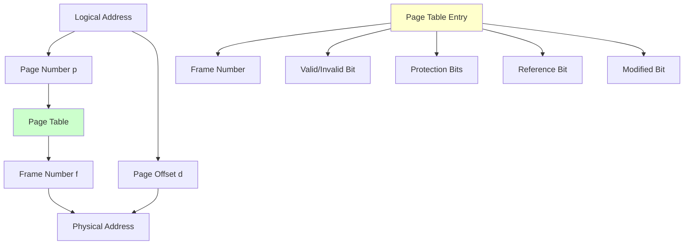
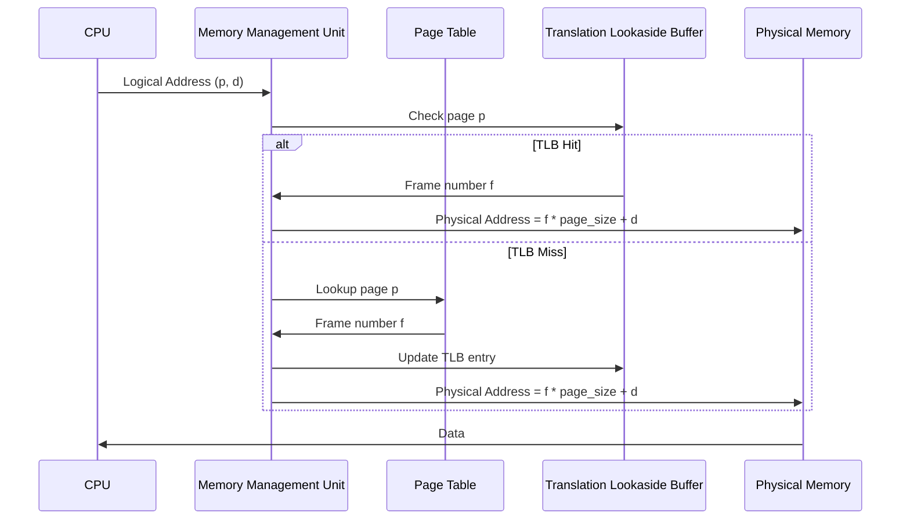

# Paging

Paging is a memory management technique that divides both logical and physical memory into fixed-size blocks called pages and frames, respectively. It eliminates external fragmentation and provides efficient memory utilization.

## 🎯 Core Concepts

### What is Paging?
- **Definition**: Memory management scheme using fixed-size pages and frames
- **Purpose**: Eliminates external fragmentation and enables non-contiguous memory allocation
- **Implementation**: Uses page table to translate logical addresses to physical addresses

### Basic Terminology
- **Page**: Fixed-size block of logical memory (typically 4KB)
- **Frame**: Fixed-size block of physical memory (same size as page)
- **Page Table**: Data structure mapping pages to frames
- **Page Fault**: Exception when accessing page not in memory

## 🗺️ Paging Architecture

### Logical Address Structure
```
Logical Address = <Page Number, Page Offset>

For 32-bit address with 4KB pages:
- Page Number: 20 bits (bits 31-12)
- Page Offset: 12 bits (bits 11-0)
```

### Address Translation Process


### Hardware Support


## 🔧 Implementation Details

### Page Table Entry Structure
```c
typedef struct {
    unsigned int frame_number : 20;     // Physical frame number
    unsigned int valid        : 1;      // Page in memory
    unsigned int referenced   : 1;      // Recently accessed
    unsigned int modified     : 1;      // Recently modified (dirty)
    unsigned int read         : 1;      // Read permission
    unsigned int write        : 1;      // Write permission
    unsigned int execute      : 1;      // Execute permission
    unsigned int user         : 1;      // User accessible
    unsigned int reserved     : 5;      // Reserved bits
} page_table_entry_t;

#define PAGE_SIZE 4096
#define PAGE_MASK 0xFFF
#define PAGE_SHIFT 12
```

### Address Translation Implementation
```c
// Basic address translation
uint32_t translate_address(uint32_t logical_address) {
    // Extract page number and offset
    uint32_t page_number = logical_address >> PAGE_SHIFT;
    uint32_t page_offset = logical_address & PAGE_MASK;
    
    // Check page table bounds
    if (page_number >= page_table_size) {
        trigger_segmentation_fault();
        return 0;
    }
    
    page_table_entry_t *pte = &page_table[page_number];
    
    // Check if page is valid
    if (!pte->valid) {
        trigger_page_fault(logical_address);
        return 0;
    }
    
    // Update reference bit
    pte->referenced = 1;
    
    // Calculate physical address
    uint32_t physical_address = (pte->frame_number << PAGE_SHIFT) | page_offset;
    return physical_address;
}
```

### Page Fault Handler
```c
void page_fault_handler(uint32_t faulting_address) {
    uint32_t page_number = faulting_address >> PAGE_SHIFT;
    page_table_entry_t *pte = &page_table[page_number];
    
    // Check if page is in swap space
    if (is_page_in_swap(page_number)) {
        // Allocate free frame
        uint32_t free_frame = allocate_free_frame();
        
        if (free_frame == INVALID_FRAME) {
            // No free frames, need to evict a page
            free_frame = evict_page();
        }
        
        // Load page from swap
        load_page_from_swap(page_number, free_frame);
        
        // Update page table entry
        pte->frame_number = free_frame;
        pte->valid = 1;
        pte->referenced = 1;
        pte->modified = 0;
        
    } else {
        // Invalid page access
        terminate_process_with_error("Segmentation fault");
    }
}
```

## 🏗️ Types of Paging Systems

### 1. Simple Paging
```c
// Simple single-level page table
typedef struct {
    page_table_entry_t *page_table;
    uint32_t page_table_size;
    uint32_t page_table_base_register;
} simple_paging_system_t;

uint32_t simple_translate(simple_paging_system_t *system, uint32_t logical_addr) {
    uint32_t page_num = logical_addr >> PAGE_SHIFT;
    uint32_t offset = logical_addr & PAGE_MASK;
    
    if (page_num >= system->page_table_size) {
        return INVALID_ADDRESS;
    }
    
    page_table_entry_t *pte = &system->page_table[page_num];
    if (!pte->valid) {
        trigger_page_fault(logical_addr);
        return INVALID_ADDRESS;
    }
    
    return (pte->frame_number << PAGE_SHIFT) | offset;
}
```

### 2. Hierarchical Paging
```c
// Two-level page table for 32-bit systems
typedef struct {
    uint32_t frame_number : 20;
    uint32_t valid        : 1;
    uint32_t reserved     : 11;
} page_directory_entry_t;

typedef struct {
    page_directory_entry_t *page_directory;
    uint32_t page_directory_size;
} hierarchical_paging_system_t;

uint32_t hierarchical_translate(hierarchical_paging_system_t *system, 
                               uint32_t logical_addr) {
    // Extract page directory index, page table index, and offset
    uint32_t pd_index = (logical_addr >> 22) & 0x3FF;    // Bits 31-22
    uint32_t pt_index = (logical_addr >> 12) & 0x3FF;    // Bits 21-12
    uint32_t offset = logical_addr & 0xFFF;               // Bits 11-0
    
    // Check page directory entry
    page_directory_entry_t *pde = &system->page_directory[pd_index];
    if (!pde->valid) {
        trigger_page_fault(logical_addr);
        return INVALID_ADDRESS;
    }
    
    // Access page table
    page_table_entry_t *page_table = 
        (page_table_entry_t*)(pde->frame_number << PAGE_SHIFT);
    page_table_entry_t *pte = &page_table[pt_index];
    
    if (!pte->valid) {
        trigger_page_fault(logical_addr);
        return INVALID_ADDRESS;
    }
    
    return (pte->frame_number << PAGE_SHIFT) | offset;
}
```

### 3. Hashed Page Tables
```c
// Hashed page table for sparse address spaces
typedef struct hash_entry {
    uint32_t page_number;
    uint32_t frame_number;
    struct hash_entry *next;
} hash_entry_t;

typedef struct {
    hash_entry_t **hash_table;
    uint32_t hash_table_size;
} hashed_paging_system_t;

uint32_t hash_function(uint32_t page_number, uint32_t table_size) {
    return page_number % table_size;
}

uint32_t hashed_translate(hashed_paging_system_t *system, uint32_t logical_addr) {
    uint32_t page_number = logical_addr >> PAGE_SHIFT;
    uint32_t offset = logical_addr & PAGE_MASK;
    
    uint32_t hash_index = hash_function(page_number, system->hash_table_size);
    hash_entry_t *entry = system->hash_table[hash_index];
    
    // Search hash chain
    while (entry != NULL) {
        if (entry->page_number == page_number) {
            return (entry->frame_number << PAGE_SHIFT) | offset;
        }
        entry = entry->next;
    }
    
    // Page not found
    trigger_page_fault(logical_addr);
    return INVALID_ADDRESS;
}
```

### 4. Inverted Page Tables
```c
// Inverted page table - one entry per physical frame
typedef struct {
    uint32_t process_id;
    uint32_t page_number;
    uint32_t next_entry;    // For collision handling
} inverted_page_entry_t;

typedef struct {
    inverted_page_entry_t *inverted_table;
    uint32_t *hash_table;   // Hash table for quick lookup
    uint32_t frame_count;
    uint32_t hash_size;
} inverted_paging_system_t;

uint32_t inverted_translate(inverted_paging_system_t *system, 
                          uint32_t process_id, uint32_t logical_addr) {
    uint32_t page_number = logical_addr >> PAGE_SHIFT;
    uint32_t offset = logical_addr & PAGE_MASK;
    
    // Hash the (process_id, page_number) pair
    uint32_t hash_value = (process_id + page_number) % system->hash_size;
    uint32_t frame_index = system->hash_table[hash_value];
    
    // Search for matching entry
    while (frame_index != INVALID_FRAME) {
        inverted_page_entry_t *entry = &system->inverted_table[frame_index];
        
        if (entry->process_id == process_id && 
            entry->page_number == page_number) {
            return (frame_index << PAGE_SHIFT) | offset;
        }
        
        frame_index = entry->next_entry;
    }
    
    // Page not found
    trigger_page_fault(logical_addr);
    return INVALID_ADDRESS;
}
```

## 🚀 Translation Lookaside Buffer (TLB)

### TLB Structure
```c
typedef struct {
    uint32_t page_number;
    uint32_t frame_number;
    uint32_t process_id;    // For context switching
    uint8_t  valid;
    uint8_t  dirty;
    uint8_t  referenced;
    uint8_t  protection;
} tlb_entry_t;

typedef struct {
    tlb_entry_t *entries;
    uint32_t size;
    uint32_t current_process_id;
} tlb_t;
```

### TLB Operations
```c
// TLB lookup
tlb_entry_t* tlb_lookup(tlb_t *tlb, uint32_t page_number) {
    for (uint32_t i = 0; i < tlb->size; i++) {
        tlb_entry_t *entry = &tlb->entries[i];
        
        if (entry->valid && 
            entry->page_number == page_number &&
            entry->process_id == tlb->current_process_id) {
            
            entry->referenced = 1;  // Update reference bit
            return entry;
        }
    }
    return NULL;  // TLB miss
}

// TLB update (after page table lookup)
void tlb_update(tlb_t *tlb, uint32_t page_number, uint32_t frame_number) {
    // Find empty entry or use replacement algorithm
    uint32_t victim_index = find_tlb_victim(tlb);
    
    tlb_entry_t *entry = &tlb->entries[victim_index];
    entry->page_number = page_number;
    entry->frame_number = frame_number;
    entry->process_id = tlb->current_process_id;
    entry->valid = 1;
    entry->referenced = 1;
    entry->dirty = 0;
}

// TLB flush on context switch
void tlb_flush(tlb_t *tlb) {
    for (uint32_t i = 0; i < tlb->size; i++) {
        tlb->entries[i].valid = 0;
    }
}
```

### TLB Replacement Algorithms
```c
// LRU replacement for TLB
uint32_t tlb_lru_replacement(tlb_t *tlb) {
    uint32_t lru_index = 0;
    uint64_t oldest_time = tlb->entries[0].last_access_time;
    
    for (uint32_t i = 1; i < tlb->size; i++) {
        if (tlb->entries[i].last_access_time < oldest_time) {
            oldest_time = tlb->entries[i].last_access_time;
            lru_index = i;
        }
    }
    
    return lru_index;
}

// Random replacement for TLB
uint32_t tlb_random_replacement(tlb_t *tlb) {
    return rand() % tlb->size;
}
```

## 🔄 Page Replacement Algorithms

### FIFO (First In First Out)
```c
typedef struct {
    uint32_t *frame_queue;
    uint32_t front;
    uint32_t rear;
    uint32_t size;
} fifo_queue_t;

uint32_t fifo_page_replacement(fifo_queue_t *queue) {
    uint32_t victim_frame = queue->frame_queue[queue->front];
    queue->front = (queue->front + 1) % queue->size;
    return victim_frame;
}

void fifo_add_page(fifo_queue_t *queue, uint32_t frame) {
    queue->frame_queue[queue->rear] = frame;
    queue->rear = (queue->rear + 1) % queue->size;
}
```

### LRU (Least Recently Used)
```c
typedef struct lru_node {
    uint32_t frame_number;
    uint64_t last_access_time;
    struct lru_node *prev;
    struct lru_node *next;
} lru_node_t;

typedef struct {
    lru_node_t *head;
    lru_node_t *tail;
    lru_node_t **frame_to_node;  // Quick lookup array
    uint32_t size;
} lru_list_t;

uint32_t lru_page_replacement(lru_list_t *lru) {
    if (lru->tail == NULL) {
        return INVALID_FRAME;
    }
    
    uint32_t victim_frame = lru->tail->frame_number;
    
    // Remove from tail
    lru_node_t *victim = lru->tail;
    lru->tail = victim->prev;
    
    if (lru->tail != NULL) {
        lru->tail->next = NULL;
    } else {
        lru->head = NULL;
    }
    
    lru->frame_to_node[victim_frame] = NULL;
    free(victim);
    
    return victim_frame;
}

void lru_access_page(lru_list_t *lru, uint32_t frame) {
    lru_node_t *node = lru->frame_to_node[frame];
    
    if (node == NULL) {
        // New page
        node = malloc(sizeof(lru_node_t));
        node->frame_number = frame;
        lru->frame_to_node[frame] = node;
    } else {
        // Move to head (most recently used)
        if (node->prev) node->prev->next = node->next;
        if (node->next) node->next->prev = node->prev;
        if (node == lru->tail) lru->tail = node->prev;
    }
    
    // Add to head
    node->last_access_time = get_current_time();
    node->prev = NULL;
    node->next = lru->head;
    
    if (lru->head != NULL) {
        lru->head->prev = node;
    }
    lru->head = node;
    
    if (lru->tail == NULL) {
        lru->tail = node;
    }
}
```

### Clock Algorithm
```c
typedef struct {
    uint32_t frame_number;
    uint8_t reference_bit;
} clock_entry_t;

typedef struct {
    clock_entry_t *frames;
    uint32_t size;
    uint32_t hand;  // Clock hand position
} clock_algorithm_t;

uint32_t clock_page_replacement(clock_algorithm_t *clock) {
    while (1) {
        clock_entry_t *current = &clock->frames[clock->hand];
        
        if (current->reference_bit == 0) {
            // Found victim
            uint32_t victim_frame = current->frame_number;
            clock->hand = (clock->hand + 1) % clock->size;
            return victim_frame;
        } else {
            // Give second chance
            current->reference_bit = 0;
            clock->hand = (clock->hand + 1) % clock->size;
        }
    }
}

void clock_reference_page(clock_algorithm_t *clock, uint32_t frame) {
    for (uint32_t i = 0; i < clock->size; i++) {
        if (clock->frames[i].frame_number == frame) {
            clock->frames[i].reference_bit = 1;
            break;
        }
    }
}
```

## 📊 Performance Analysis

### Memory Access Time Calculation
```c
// Effective memory access time calculation
typedef struct {
    double tlb_hit_ratio;           // Percentage of TLB hits
    double page_fault_ratio;        // Percentage of page faults
    double tlb_access_time;         // TLB access time (ns)
    double memory_access_time;      // Memory access time (ns)
    double page_fault_service_time; // Page fault handling time (ms)
} memory_performance_t;

double calculate_effective_access_time(memory_performance_t *perf) {
    double tlb_hit_time = perf->tlb_access_time + perf->memory_access_time;
    double tlb_miss_time = perf->tlb_access_time + 2 * perf->memory_access_time;
    
    double base_time = perf->tlb_hit_ratio * tlb_hit_time + 
                      (1 - perf->tlb_hit_ratio) * tlb_miss_time;
    
    double page_fault_overhead = perf->page_fault_ratio * 
                                perf->page_fault_service_time * 1000000; // Convert ms to ns
    
    return base_time + page_fault_overhead;
}
```

### Page Fault Statistics
```c
typedef struct {
    uint64_t total_page_accesses;
    uint64_t page_faults;
    uint64_t tlb_hits;
    uint64_t tlb_misses;
    uint64_t pages_swapped_in;
    uint64_t pages_swapped_out;
} paging_statistics_t;

void print_paging_statistics(paging_statistics_t *stats) {
    double page_fault_rate = (double)stats->page_faults / stats->total_page_accesses;
    double tlb_hit_rate = (double)stats->tlb_hits / 
                         (stats->tlb_hits + stats->tlb_misses);
    
    printf("Paging Performance Statistics:\n");
    printf("Total Page Accesses: %lu\n", stats->total_page_accesses);
    printf("Page Fault Rate: %.4f%%\n", page_fault_rate * 100);
    printf("TLB Hit Rate: %.4f%%\n", tlb_hit_rate * 100);
    printf("Pages Swapped In: %lu\n", stats->pages_swapped_in);
    printf("Pages Swapped Out: %lu\n", stats->pages_swapped_out);
}
```

## ✅ Advantages of Paging

### 1. Eliminates External Fragmentation
- **Fixed-size blocks**: All pages and frames are the same size
- **No unused gaps**: Memory is utilized efficiently
- **Simplified allocation**: Any free frame can hold any page

### 2. Supports Virtual Memory
```c
// Virtual memory implementation with paging
typedef struct {
    uint32_t total_pages;
    uint32_t resident_pages;
    uint32_t swap_pages;
    page_table_entry_t *page_table;
} virtual_memory_t;

bool is_page_resident(virtual_memory_t *vm, uint32_t page_number) {
    if (page_number >= vm->total_pages) {
        return false;
    }
    return vm->page_table[page_number].valid;
}
```

### 3. Protection and Sharing
```c
// Page-level protection
bool check_page_permission(page_table_entry_t *pte, uint8_t access_type) {
    if (!pte->valid) return false;
    
    switch (access_type) {
        case ACCESS_READ:
            return pte->read;
        case ACCESS_WRITE:
            return pte->write;
        case ACCESS_EXECUTE:
            return pte->execute;
        default:
            return false;
    }
}
```

## ❌ Disadvantages of Paging

### 1. Internal Fragmentation
```c
// Calculate internal fragmentation
uint32_t calculate_internal_fragmentation(uint32_t allocated_size) {
    uint32_t pages_needed = (allocated_size + PAGE_SIZE - 1) / PAGE_SIZE;
    uint32_t allocated_space = pages_needed * PAGE_SIZE;
    return allocated_space - allocated_size;
}
```

### 2. Translation Overhead
- **TLB misses**: Expensive page table walks
- **Memory overhead**: Page tables consume memory
- **Context switching**: TLB flushes on process switches

### 3. Page Table Size
```c
// Page table memory overhead calculation
uint32_t calculate_page_table_size(uint32_t virtual_address_bits, 
                                  uint32_t page_size_bits) {
    uint32_t page_bits = virtual_address_bits - page_size_bits;
    uint32_t total_pages = 1 << page_bits;
    return total_pages * sizeof(page_table_entry_t);
}

// Example: 32-bit virtual address space with 4KB pages
// Page table size = 2^20 * 4 bytes = 4MB per process
```

## 🎯 Interview Questions & Answers

### Q1: What is paging and how does it differ from segmentation?
**Answer**:
- **Paging**: Divides memory into fixed-size pages and frames, eliminates external fragmentation
- **Segmentation**: Divides memory into variable-size segments based on logical structure
- **Key Differences**:
  - Paging: Fixed size, no external fragmentation, internal fragmentation possible
  - Segmentation: Variable size, external fragmentation, no internal fragmentation
  - Paging provides better memory utilization, segmentation provides better logical organization

### Q2: How does address translation work in paging?
**Answer**:
1. **Split logical address**: Page number (high bits) + Page offset (low bits)
2. **TLB lookup**: Check if translation is cached in TLB
3. **Page table access**: If TLB miss, access page table using page number
4. **Frame lookup**: Get frame number from page table entry
5. **Physical address**: Combine frame number with page offset
6. **Protection check**: Verify access permissions

### Q3: What is a TLB and why is it important?
**Answer**:
**TLB (Translation Lookaside Buffer)**: High-speed cache storing recent page-to-frame translations
**Importance**:
- **Performance**: Avoids expensive page table lookups
- **Locality**: Exploits temporal and spatial locality of memory accesses
- **Hardware acceleration**: Provides fast address translation
- **Bottleneck prevention**: Prevents memory management from becoming performance bottleneck

### Q4: Compare different page replacement algorithms.
**Answer**:
- **FIFO**: Simple implementation, suffers from Belady's anomaly
- **LRU**: Good performance, expensive to implement perfectly
- **Clock**: Approximates LRU with lower overhead, uses reference bits
- **Optimal**: Best theoretical performance, not implementable in practice
- **Working Set**: Based on locality principle, requires tracking page references

### Q5: What are the advantages and disadvantages of hierarchical paging?
**Answer**:
**Advantages**:
- Reduces page table size for sparse address spaces
- Supports large virtual address spaces efficiently
- Page table pages can be swapped out

**Disadvantages**:
- Multiple memory accesses for address translation
- Increased TLB miss penalty
- More complex hardware and software implementation
- Higher memory overhead for small processes

---
[← Back to Main Guide](./README.md) | [← Previous: Segmentation](./segmentation.md) | [Next: Virtual Memory →](./virtual-memory.md)

**Related Topics:**
- [Segmentation](./segmentation.md) - Alternative memory management technique
- [Virtual Memory](./virtual-memory.md) - Advanced paging with demand loading
- [Memory Allocation](./memory-allocation.md) - Physical memory management
- [Cache Memory](./cache-memory.md) - Memory hierarchy and caching
