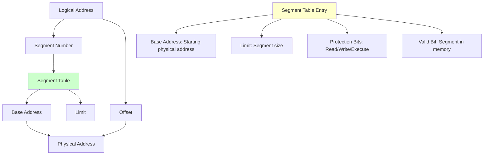
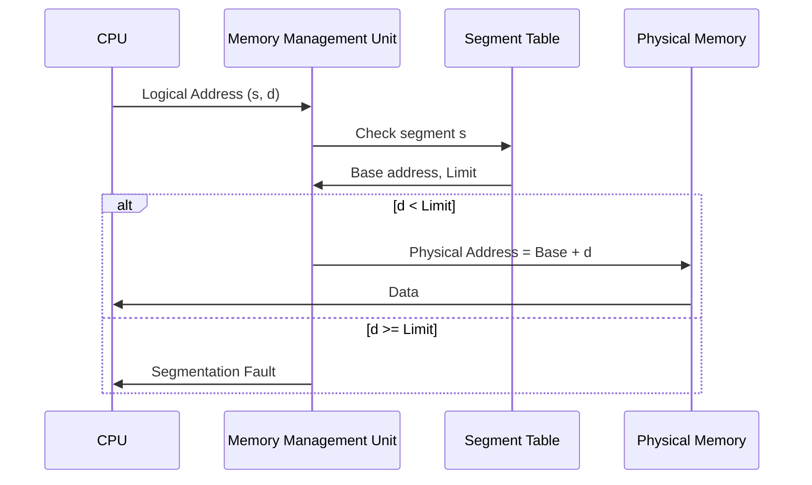

# Segmentation

Segmentation is a memory management technique that divides the memory into variable-sized segments based on the logical structure of programs, such as functions, arrays, or objects.

## 🎯 Core Concepts

### What is Segmentation?
- **Definition**: Memory management scheme that divides memory into logical segments of variable sizes
- **Purpose**: Provides logical view of memory that matches program structure
- **Implementation**: Uses segment table to translate logical addresses to physical addresses

### Segment Structure
```
Logical Address = <Segment Number, Offset>
```

## 🗺️ Segmentation Architecture

### Segment Table


### Address Translation Process


## 🔧 Implementation Details

### Segment Table Entry Structure
```c
typedef struct {
    uint32_t base_address;    // Starting physical address
    uint32_t limit;          // Size of segment
    uint8_t  protection;     // Read/Write/Execute permissions
    uint8_t  valid;          // Segment present in memory
    uint8_t  referenced;     // Recently accessed
    uint8_t  modified;       // Recently modified
} segment_table_entry_t;
```

### Address Translation Algorithm
```c
// Address translation in segmentation
uint32_t translate_address(uint16_t segment_num, uint32_t offset) {
    // Check if segment number is valid
    if (segment_num >= segment_table_size) {
        trigger_segmentation_fault();
        return 0;
    }
    
    segment_table_entry_t *entry = &segment_table[segment_num];
    
    // Check if segment is valid and in memory
    if (!entry->valid) {
        trigger_segment_fault();
        return 0;
    }
    
    // Check bounds
    if (offset >= entry->limit) {
        trigger_segmentation_fault();
        return 0;
    }
    
    // Check permissions (example for read operation)
    if (!(entry->protection & READ_PERMISSION)) {
        trigger_protection_fault();
        return 0;
    }
    
    // Calculate physical address
    return entry->base_address + offset;
}
```

### Segmentation Hardware Support
```c
// Hardware registers for segmentation
typedef struct {
    uint32_t segment_table_base;    // Base address of segment table
    uint16_t segment_table_length;  // Number of segments
    uint16_t current_segment;       // Currently executing segment
} segmentation_registers_t;

// Example: Intel x86 segment registers
typedef struct {
    uint16_t cs;    // Code Segment
    uint16_t ds;    // Data Segment
    uint16_t es;    // Extra Segment
    uint16_t fs;    // Additional Data Segment
    uint16_t gs;    // Additional Data Segment
    uint16_t ss;    // Stack Segment
} x86_segment_registers_t;
```

## 🏗️ Types of Segmentation

### 1. Simple Segmentation
```c
// Simple segmentation with basic segments
enum segment_type {
    CODE_SEGMENT = 0,
    DATA_SEGMENT = 1,
    STACK_SEGMENT = 2,
    HEAP_SEGMENT = 3
};

typedef struct {
    enum segment_type type;
    uint32_t base_address;
    uint32_t size;
    uint8_t permissions;
} simple_segment_t;
```

### 2. Segmentation with Paging
```c
// Combined segmentation and paging
typedef struct {
    uint32_t segment_base;      // Base of segment page table
    uint32_t segment_limit;     // Size in pages
    uint8_t  protection;        // Segment permissions
    uint8_t  paging_enabled;    // Use paging within segment
} segment_paging_entry_t;

// Two-level address translation
uint32_t seg_page_translate(uint16_t seg, uint16_t page, uint16_t offset) {
    // First: Segment translation
    segment_paging_entry_t *seg_entry = &seg_page_table[seg];
    
    if (!seg_entry->paging_enabled) {
        // Direct segmentation
        return seg_entry->segment_base + (page << 12) + offset;
    }
    
    // Second: Page translation within segment
    uint32_t page_table_base = seg_entry->segment_base;
    page_table_entry_t *page_entry = &page_table[page_table_base + page];
    
    return (page_entry->frame_number << 12) + offset;
}
```

### 3. Pure Segmentation
```c
// Pure segmentation without fixed segment types
typedef struct {
    char name[32];              // Segment name/identifier
    uint32_t base_address;      // Physical start address
    uint32_t virtual_address;   // Virtual start address
    uint32_t size;              // Segment size
    uint32_t permissions;       // Access permissions
    uint32_t sharing_count;     // Number of processes sharing
} pure_segment_t;

// Dynamic segment allocation
pure_segment_t* allocate_segment(uint32_t size, uint32_t permissions) {
    // Find free memory block of required size
    uint32_t physical_addr = find_free_memory(size);
    
    if (physical_addr == 0) {
        return NULL;  // No space available
    }
    
    pure_segment_t *segment = malloc(sizeof(pure_segment_t));
    segment->base_address = physical_addr;
    segment->size = size;
    segment->permissions = permissions;
    segment->sharing_count = 1;
    
    return segment;
}
```

## ✅ Advantages of Segmentation

### 1. Logical Organization
- **Natural Mapping**: Segments correspond to logical program units
- **Protection**: Different segments can have different protection levels
- **Sharing**: Code segments can be shared between processes

### 2. Variable Size
- **Flexibility**: Segments can grow and shrink as needed
- **Efficiency**: No internal fragmentation within segments
- **Dynamic Allocation**: Segments can be allocated at runtime

### 3. Memory Protection
```c
// Protection implementation
typedef enum {
    SEG_READ    = 0x01,
    SEG_WRITE   = 0x02,
    SEG_EXECUTE = 0x04,
    SEG_KERNEL  = 0x08
} segment_permissions_t;

bool check_segment_access(uint16_t segment, uint8_t access_type) {
    segment_table_entry_t *entry = &segment_table[segment];
    
    // Check if segment exists and is valid
    if (!entry->valid) {
        return false;
    }
    
    // Check specific permission
    if (!(entry->protection & access_type)) {
        return false;
    }
    
    // Check privilege level
    if ((access_type & SEG_KERNEL) && !is_kernel_mode()) {
        return false;
    }
    
    return true;
}
```

## ❌ Disadvantages of Segmentation

### 1. External Fragmentation
```c
// External fragmentation demonstration
typedef struct memory_block {
    uint32_t start_address;
    uint32_t size;
    bool is_free;
    struct memory_block *next;
} memory_block_t;

// Memory fragmentation calculation
float calculate_fragmentation() {
    uint32_t total_free = 0;
    uint32_t largest_free = 0;
    
    memory_block_t *current = memory_list;
    while (current != NULL) {
        if (current->is_free) {
            total_free += current->size;
            if (current->size > largest_free) {
                largest_free = current->size;
            }
        }
        current = current->next;
    }
    
    if (total_free == 0) return 0.0;
    
    // Fragmentation = 1 - (largest_free / total_free)
    return 1.0 - ((float)largest_free / total_free);
}
```

### 2. Complex Memory Management
- **Allocation Algorithms**: Need sophisticated algorithms for segment placement
- **Compaction**: Periodic memory compaction required
- **Overhead**: Segment table maintenance overhead

### 3. Limited Sharing
```c
// Sharing limitations in pure segmentation
typedef struct shared_segment {
    uint32_t segment_id;
    uint32_t reference_count;
    uint32_t physical_address;
    uint32_t size;
    process_id_t *sharing_processes;
} shared_segment_t;

// Sharing becomes complex with different virtual addresses
void share_segment(process_id_t pid1, process_id_t pid2, uint32_t segment_id) {
    shared_segment_t *seg = find_shared_segment(segment_id);
    
    // Each process may map segment at different virtual addresses
    // This complicates pointer sharing within segments
    map_segment_to_process(pid1, seg, VIRTUAL_ADDR_1);
    map_segment_to_process(pid2, seg, VIRTUAL_ADDR_2);
    
    seg->reference_count += 2;
}
```

## 🔄 Memory Allocation in Segmentation

### First Fit Algorithm
```c
memory_block_t* first_fit_allocate(uint32_t size) {
    memory_block_t *current = memory_list;
    
    while (current != NULL) {
        if (current->is_free && current->size >= size) {
            // Split block if necessary
            if (current->size > size) {
                memory_block_t *new_block = malloc(sizeof(memory_block_t));
                new_block->start_address = current->start_address + size;
                new_block->size = current->size - size;
                new_block->is_free = true;
                new_block->next = current->next;
                current->next = new_block;
            }
            
            current->size = size;
            current->is_free = false;
            return current;
        }
        current = current->next;
    }
    
    return NULL;  // No suitable block found
}
```

### Best Fit Algorithm
```c
memory_block_t* best_fit_allocate(uint32_t size) {
    memory_block_t *current = memory_list;
    memory_block_t *best_block = NULL;
    uint32_t smallest_suitable_size = UINT32_MAX;
    
    while (current != NULL) {
        if (current->is_free && current->size >= size) {
            if (current->size < smallest_suitable_size) {
                smallest_suitable_size = current->size;
                best_block = current;
            }
        }
        current = current->next;
    }
    
    if (best_block != NULL) {
        // Allocate the best fitting block
        if (best_block->size > size) {
            // Split the block
            memory_block_t *new_block = malloc(sizeof(memory_block_t));
            new_block->start_address = best_block->start_address + size;
            new_block->size = best_block->size - size;
            new_block->is_free = true;
            new_block->next = best_block->next;
            best_block->next = new_block;
        }
        
        best_block->size = size;
        best_block->is_free = false;
    }
    
    return best_block;
}
```

### Worst Fit Algorithm
```c
memory_block_t* worst_fit_allocate(uint32_t size) {
    memory_block_t *current = memory_list;
    memory_block_t *worst_block = NULL;
    uint32_t largest_suitable_size = 0;
    
    while (current != NULL) {
        if (current->is_free && current->size >= size) {
            if (current->size > largest_suitable_size) {
                largest_suitable_size = current->size;
                worst_block = current;
            }
        }
        current = current->next;
    }
    
    if (worst_block != NULL) {
        // Split the largest block
        if (worst_block->size > size) {
            memory_block_t *new_block = malloc(sizeof(memory_block_t));
            new_block->start_address = worst_block->start_address + size;
            new_block->size = worst_block->size - size;
            new_block->is_free = true;
            new_block->next = worst_block->next;
            worst_block->next = new_block;
        }
        
        worst_block->size = size;
        worst_block->is_free = false;
    }
    
    return worst_block;
}
```

## 🔄 Memory Compaction

### Compaction Algorithm
```c
void compact_memory() {
    memory_block_t *current = memory_list;
    uint32_t compact_address = 0;
    
    // Phase 1: Move all allocated blocks to the beginning
    while (current != NULL) {
        if (!current->is_free) {
            if (current->start_address != compact_address) {
                // Move memory content
                memmove((void*)compact_address, 
                       (void*)current->start_address, 
                       current->size);
                
                // Update segment table entries
                update_segment_base_addresses(current->start_address, 
                                            compact_address, 
                                            current->size);
                
                current->start_address = compact_address;
            }
            compact_address += current->size;
        }
        current = current->next;
    }
    
    // Phase 2: Merge all free blocks into one large block
    merge_free_blocks(compact_address);
}

void update_segment_base_addresses(uint32_t old_base, uint32_t new_base, uint32_t size) {
    for (int i = 0; i < segment_table_size; i++) {
        if (segment_table[i].valid && 
            segment_table[i].base_address >= old_base &&
            segment_table[i].base_address < old_base + size) {
            
            uint32_t offset = segment_table[i].base_address - old_base;
            segment_table[i].base_address = new_base + offset;
        }
    }
}
```

## 📊 Performance Analysis

### Memory Utilization
```c
typedef struct {
    uint32_t total_memory;
    uint32_t allocated_memory;
    uint32_t free_memory;
    uint32_t largest_free_block;
    float fragmentation_ratio;
    uint32_t number_of_segments;
} memory_stats_t;

memory_stats_t get_memory_statistics() {
    memory_stats_t stats = {0};
    memory_block_t *current = memory_list;
    
    while (current != NULL) {
        stats.total_memory += current->size;
        
        if (current->is_free) {
            stats.free_memory += current->size;
            if (current->size > stats.largest_free_block) {
                stats.largest_free_block = current->size;
            }
        } else {
            stats.allocated_memory += current->size;
            stats.number_of_segments++;
        }
        
        current = current->next;
    }
    
    // Calculate fragmentation
    if (stats.free_memory > 0) {
        stats.fragmentation_ratio = 1.0 - 
            ((float)stats.largest_free_block / stats.free_memory);
    }
    
    return stats;
}
```

### Address Translation Overhead
```c
// Performance measurement for address translation
typedef struct {
    uint64_t translation_count;
    uint64_t translation_time_ns;
    uint64_t segment_faults;
    uint64_t protection_violations;
} translation_stats_t;

translation_stats_t perf_stats = {0};

uint32_t translate_address_with_stats(uint16_t segment_num, uint32_t offset) {
    uint64_t start_time = get_nanoseconds();
    perf_stats.translation_count++;
    
    if (segment_num >= segment_table_size) {
        perf_stats.segment_faults++;
        trigger_segmentation_fault();
        return 0;
    }
    
    segment_table_entry_t *entry = &segment_table[segment_num];
    
    if (!entry->valid || offset >= entry->limit) {
        perf_stats.segment_faults++;
        trigger_segmentation_fault();
        return 0;
    }
    
    uint32_t physical_addr = entry->base_address + offset;
    
    uint64_t end_time = get_nanoseconds();
    perf_stats.translation_time_ns += (end_time - start_time);
    
    return physical_addr;
}
```

## 🎯 Interview Questions & Answers

### Q1: What is segmentation and how does it differ from paging?
**Answer**: 
- **Segmentation**: Divides memory into variable-sized logical segments (code, data, stack)
- **Paging**: Divides memory into fixed-sized pages
- **Key Differences**:
  - Segmentation: Variable size, logical organization, external fragmentation
  - Paging: Fixed size, no external fragmentation, internal fragmentation
  - Segmentation provides better logical organization while paging provides better memory utilization

### Q2: What are the advantages and disadvantages of segmentation?
**Answer**:
**Advantages**:
- Logical organization matching program structure
- Variable segment sizes with no internal fragmentation
- Different protection levels for different segments
- Easy sharing of code segments between processes

**Disadvantages**:
- External fragmentation due to variable sizes
- Complex memory management and allocation algorithms
- Memory compaction overhead
- Limited address space if using small segment numbers

### Q3: How does address translation work in segmentation?
**Answer**:
1. **Logical Address**: Consists of <segment number, offset>
2. **Segment Table Lookup**: Use segment number to index into segment table
3. **Bounds Checking**: Verify offset < segment limit
4. **Address Calculation**: Physical Address = Base Address + Offset
5. **Protection Check**: Verify access permissions (read/write/execute)

### Q4: What is external fragmentation and how can it be solved in segmentation?
**Answer**:
**External Fragmentation**: Free memory exists but is divided into small, non-contiguous blocks that cannot satisfy allocation requests.

**Solutions**:
- **Memory Compaction**: Move allocated segments to create larger free blocks
- **Best Fit Allocation**: Minimizes wasted space in allocated blocks
- **Segmentation with Paging**: Combine segmentation with paging to eliminate external fragmentation

### Q5: How do you implement shared segments in a segmentation system?
**Answer**:
- **Shared Segment Table**: Maintain references to segments shared between processes
- **Reference Counting**: Track how many processes are using each shared segment
- **Copy-on-Write**: Share read-only segments, create copies only when writing
- **Protection**: Ensure proper access control for shared segments
- **Virtual Address Mapping**: Each process can map shared segment at different virtual addresses

---
[← Back to Main Guide](./README.md) | [← Previous: Memory Allocation](./memory-allocation.md) | [Next: Paging →](./paging.md)

**Related Topics:**
- [Memory Allocation](./memory-allocation.md) - Memory management fundamentals
- [Paging](./paging.md) - Alternative memory management technique
- [Virtual Memory](./virtual-memory.md) - Advanced memory management with paging
- [Process vs Thread](./process-vs-thread.md) - Memory organization in processes
