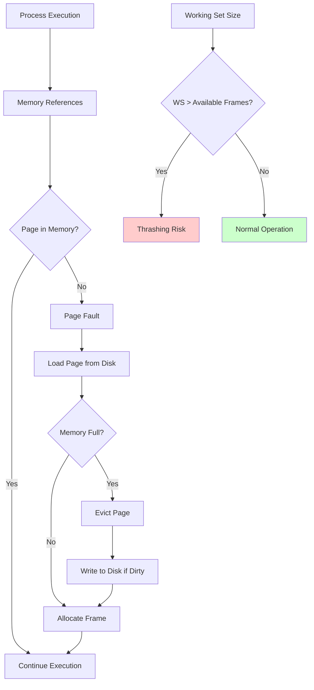

# Thrashing

Thrashing is a condition in which excessive paging operations take place, causing the system to spend more time swapping pages in and out of memory than executing useful work. It severely degrades system performance.

## 🎯 Core Concepts

### What is Thrashing?
- **Definition**: Excessive paging activity that prevents useful work from being done
- **Cause**: When the working set of processes exceeds available physical memory
- **Symptom**: High page fault rate with low CPU utilization
- **Effect**: System becomes unresponsive due to constant disk I/O

### Working Set Model


## 📊 Thrashing Detection and Measurement

### Page Fault Rate Monitoring
```c
typedef struct {
    uint64_t page_faults;
    uint64_t memory_accesses;
    uint64_t time_window_start;
    uint64_t time_window_duration;
    double page_fault_rate;
    double cpu_utilization;
} thrashing_monitor_t;

void update_thrashing_metrics(thrashing_monitor_t *monitor) {
    uint64_t current_time = get_current_time_ms();
    
    // Calculate page fault rate
    if (current_time - monitor->time_window_start >= monitor->time_window_duration) {
        monitor->page_fault_rate = (double)monitor->page_faults / 
                                  monitor->memory_accesses;
        
        // Reset counters for next window
        monitor->page_faults = 0;
        monitor->memory_accesses = 0;
        monitor->time_window_start = current_time;
    }
}

bool is_thrashing(thrashing_monitor_t *monitor) {
    // Thrashing indicators:
    // 1. High page fault rate (> 0.1 = 10%)
    // 2. Low CPU utilization (< 20%)
    // 3. High disk I/O activity
    
    return (monitor->page_fault_rate > 0.10) && 
           (monitor->cpu_utilization < 0.20);
}
```

### Working Set Size Calculation
```c
typedef struct working_set_entry {
    uint32_t page_number;
    uint64_t last_reference_time;
    struct working_set_entry *next;
} working_set_entry_t;

typedef struct {
    working_set_entry_t **hash_table;
    uint32_t hash_size;
    uint64_t window_size;  // Working set window in milliseconds
    uint32_t current_size;
} working_set_t;

uint32_t calculate_working_set_size(working_set_t *ws) {
    uint64_t current_time = get_current_time_ms();
    uint64_t cutoff_time = current_time - ws->window_size;
    uint32_t working_set_size = 0;
    
    for (uint32_t i = 0; i < ws->hash_size; i++) {
        working_set_entry_t *entry = ws->hash_table[i];
        while (entry != NULL) {
            if (entry->last_reference_time >= cutoff_time) {
                working_set_size++;
            }
            entry = entry->next;
        }
    }
    
    ws->current_size = working_set_size;
    return working_set_size;
}

void add_to_working_set(working_set_t *ws, uint32_t page_number) {
    uint32_t hash_index = page_number % ws->hash_size;
    working_set_entry_t *entry = ws->hash_table[hash_index];
    
    // Check if page already in working set
    while (entry != NULL) {
        if (entry->page_number == page_number) {
            entry->last_reference_time = get_current_time_ms();
            return;
        }
        entry = entry->next;
    }
    
    // Add new entry
    working_set_entry_t *new_entry = malloc(sizeof(working_set_entry_t));
    new_entry->page_number = page_number;
    new_entry->last_reference_time = get_current_time_ms();
    new_entry->next = ws->hash_table[hash_index];
    ws->hash_table[hash_index] = new_entry;
}
```

## 🚨 Causes of Thrashing

### 1. Excessive Multiprogramming
```c
typedef struct {
    uint32_t process_count;
    uint32_t total_working_set_size;
    uint32_t available_frames;
    double memory_pressure;
} multiprogramming_monitor_t;

void analyze_multiprogramming_load(multiprogramming_monitor_t *monitor) {
    monitor->memory_pressure = (double)monitor->total_working_set_size / 
                              monitor->available_frames;
    
    if (monitor->memory_pressure > 1.0) {
        printf("WARNING: Memory overcommitted by %.2fx\n", 
               monitor->memory_pressure);
        printf("Consider reducing process count from %u\n", 
               monitor->process_count);
    }
}

uint32_t calculate_optimal_process_count(uint32_t available_frames, 
                                       uint32_t avg_working_set_size) {
    // Leave some frames for buffer to prevent thrashing
    uint32_t usable_frames = available_frames * 0.9;  // 90% utilization
    return usable_frames / avg_working_set_size;
}
```

### 2. Inadequate Memory Allocation
```c
typedef struct process_memory {
    uint32_t process_id;
    uint32_t allocated_frames;
    uint32_t working_set_size;
    uint32_t page_fault_count;
    double page_fault_rate;
} process_memory_t;

void rebalance_memory_allocation(process_memory_t *processes, 
                               uint32_t process_count,
                               uint32_t total_frames) {
    uint32_t total_working_set = 0;
    
    // Calculate total working set demand
    for (uint32_t i = 0; i < process_count; i++) {
        total_working_set += processes[i].working_set_size;
    }
    
    if (total_working_set > total_frames) {
        // Proportional allocation based on working set size
        for (uint32_t i = 0; i < process_count; i++) {
            uint32_t new_allocation = 
                (processes[i].working_set_size * total_frames) / total_working_set;
            
            // Ensure minimum allocation
            if (new_allocation < MIN_FRAMES_PER_PROCESS) {
                new_allocation = MIN_FRAMES_PER_PROCESS;
            }
            
            processes[i].allocated_frames = new_allocation;
        }
    }
}
```

### 3. Poor Page Replacement Strategy
```c
// Anti-thrashing page replacement algorithm
typedef struct {
    uint32_t frame_number;
    uint32_t process_id;
    uint64_t last_access_time;
    uint32_t access_frequency;
    bool is_working_set_page;
} anti_thrash_frame_t;

uint32_t anti_thrash_page_replacement(anti_thrash_frame_t *frames, 
                                    uint32_t frame_count,
                                    uint32_t requesting_process) {
    uint32_t victim_frame = 0;
    uint64_t oldest_time = UINT64_MAX;
    uint32_t lowest_frequency = UINT32_MAX;
    
    for (uint32_t i = 0; i < frame_count; i++) {
        // Never evict working set pages of the requesting process
        if (frames[i].process_id == requesting_process && 
            frames[i].is_working_set_page) {
            continue;
        }
        
        // Prefer pages from different processes
        if (frames[i].process_id != requesting_process) {
            if (frames[i].last_access_time < oldest_time) {
                oldest_time = frames[i].last_access_time;
                victim_frame = i;
            }
        }
        // If same process, choose least frequently used
        else if (frames[i].access_frequency < lowest_frequency) {
            lowest_frequency = frames[i].access_frequency;
            victim_frame = i;
        }
    }
    
    return victim_frame;
}
```

## 🛡️ Thrashing Prevention Strategies

### 1. Working Set Algorithm
```c
typedef struct {
    uint32_t *working_set_pages;
    uint32_t working_set_size;
    uint64_t window_size;
    uint64_t last_update_time;
} working_set_algorithm_t;

void working_set_page_fault_handler(working_set_algorithm_t *ws, 
                                  uint32_t faulting_page,
                                  uint32_t process_id) {
    uint64_t current_time = get_current_time_ms();
    
    // Update working set
    update_working_set(ws, current_time);
    
    // Check if we have enough frames for working set
    uint32_t allocated_frames = get_allocated_frames(process_id);
    
    if (ws->working_set_size > allocated_frames) {
        // Request more frames or suspend process
        if (!request_additional_frames(process_id, 
                                     ws->working_set_size - allocated_frames)) {
            suspend_process_to_prevent_thrashing(process_id);
            return;
        }
    }
    
    // Proceed with normal page fault handling
    handle_page_fault(faulting_page, process_id);
}

void update_working_set(working_set_algorithm_t *ws, uint64_t current_time) {
    uint64_t cutoff_time = current_time - ws->window_size;
    uint32_t new_size = 0;
    
    // Remove pages not accessed within window
    for (uint32_t i = 0; i < ws->working_set_size; i++) {
        uint64_t last_access = get_page_last_access_time(ws->working_set_pages[i]);
        if (last_access >= cutoff_time) {
            ws->working_set_pages[new_size++] = ws->working_set_pages[i];
        }
    }
    
    ws->working_set_size = new_size;
    ws->last_update_time = current_time;
}
```

### 2. Page Fault Frequency (PFF) Algorithm
```c
typedef struct {
    double page_fault_frequency;
    double upper_threshold;    // Increase frames if PFF > upper
    double lower_threshold;    // Decrease frames if PFF < lower
    uint64_t last_fault_time;
    uint32_t fault_count;
    uint32_t allocated_frames;
} pff_controller_t;

void pff_page_fault_handler(pff_controller_t *pff, uint32_t process_id) {
    uint64_t current_time = get_current_time_ms();
    uint64_t inter_fault_time = current_time - pff->last_fault_time;
    
    pff->fault_count++;
    pff->last_fault_time = current_time;
    
    // Calculate instantaneous page fault frequency
    pff->page_fault_frequency = 1000.0 / inter_fault_time;  // faults per second
    
    if (pff->page_fault_frequency > pff->upper_threshold) {
        // Too many page faults - increase frame allocation
        uint32_t additional_frames = calculate_additional_frames_needed(pff);
        
        if (!allocate_additional_frames(process_id, additional_frames)) {
            // Cannot allocate more frames - suspend some processes
            suspend_low_priority_processes();
        }
        
    } else if (pff->page_fault_frequency < pff->lower_threshold) {
        // Too few page faults - can release some frames
        uint32_t frames_to_release = calculate_excess_frames(pff);
        release_frames(process_id, frames_to_release);
        pff->allocated_frames -= frames_to_release;
    }
}

uint32_t calculate_additional_frames_needed(pff_controller_t *pff) {
    // Increase frames proportionally to how much we exceed threshold
    double excess_ratio = pff->page_fault_frequency / pff->upper_threshold;
    uint32_t additional = (uint32_t)(pff->allocated_frames * (excess_ratio - 1.0) * 0.1);
    
    return (additional > 0) ? additional : 1;
}
```

### 3. Load Control
```c
typedef struct {
    uint32_t max_processes;
    uint32_t current_processes;
    uint32_t total_available_frames;
    uint32_t reserved_frames;
    double system_load_average;
    queue_t *ready_queue;
    queue_t *suspended_queue;
} load_controller_t;

void adaptive_load_control(load_controller_t *controller) {
    double memory_utilization = calculate_memory_utilization();
    double cpu_utilization = get_cpu_utilization();
    double page_fault_rate = get_system_page_fault_rate();
    
    // Thrashing detection criteria
    bool is_thrashing_detected = (page_fault_rate > 0.10) && 
                                (cpu_utilization < 0.20) &&
                                (memory_utilization > 0.95);
    
    if (is_thrashing_detected) {
        // Suspend lowest priority process
        process_t *victim = select_victim_process(controller->ready_queue);
        if (victim != NULL) {
            suspend_process(victim);
            move_to_queue(controller->ready_queue, 
                         controller->suspended_queue, victim);
            controller->current_processes--;
        }
    } else if (can_admit_new_process(controller)) {
        // Try to resume a suspended process
        process_t *candidate = peek_queue(controller->suspended_queue);
        if (candidate != NULL && 
            can_accommodate_process(candidate, controller)) {
            resume_process(candidate);
            move_to_queue(controller->suspended_queue, 
                         controller->ready_queue, candidate);
            controller->current_processes++;
        }
    }
}

bool can_accommodate_process(process_t *process, load_controller_t *controller) {
    uint32_t estimated_working_set = estimate_working_set_size(process);
    uint32_t available_frames = controller->total_available_frames - 
                               controller->reserved_frames - 
                               get_total_allocated_frames();
    
    return (available_frames >= estimated_working_set) &&
           (controller->current_processes < controller->max_processes);
}
```

## 📈 Performance Impact Analysis

### System Performance Metrics
```c
typedef struct {
    double effective_cpu_utilization;
    double memory_utilization;
    double disk_utilization;
    double system_throughput;
    double average_response_time;
    uint64_t total_page_faults;
    uint64_t thrashing_time_ms;
} performance_metrics_t;

void calculate_thrashing_impact(performance_metrics_t *metrics) {
    // Calculate performance degradation due to thrashing
    double normal_throughput = get_baseline_throughput();
    double degradation_factor = metrics->system_throughput / normal_throughput;
    
    printf("System Performance Analysis:\n");
    printf("CPU Utilization: %.2f%%\n", metrics->effective_cpu_utilization * 100);
    printf("Memory Utilization: %.2f%%\n", metrics->memory_utilization * 100);
    printf("Disk Utilization: %.2f%%\n", metrics->disk_utilization * 100);
    printf("Throughput Degradation: %.2fx\n", 1.0 / degradation_factor);
    printf("Response Time Impact: %.2fx slower\n", 
           metrics->average_response_time / get_baseline_response_time());
    
    if (degradation_factor < 0.5) {
        printf("WARNING: System experiencing severe thrashing!\n");
    }
}
```

### Memory Pressure Calculation
```c
double calculate_memory_pressure() {
    uint32_t total_working_set = 0;
    uint32_t active_processes = get_active_process_count();
    
    for (uint32_t i = 0; i < active_processes; i++) {
        process_t *proc = get_process_by_index(i);
        total_working_set += get_process_working_set_size(proc->pid);
    }
    
    uint32_t available_memory = get_available_memory_frames();
    double pressure = (double)total_working_set / available_memory;
    
    return pressure;
}

void memory_pressure_response(double pressure) {
    if (pressure > 1.5) {
        // Critical pressure - aggressive action needed
        suspend_multiple_processes(2);
        increase_swap_space();
    } else if (pressure > 1.2) {
        // High pressure - moderate action
        suspend_lowest_priority_process();
    } else if (pressure > 1.0) {
        // Warning level - preventive action
        reduce_working_set_sizes();
        optimize_page_replacement();
    }
}
```

## 🔧 Recovery Strategies

### Process Suspension and Resumption
```c
typedef enum {
    SUSPEND_REASON_THRASHING,
    SUSPEND_REASON_LOW_PRIORITY,
    SUSPEND_REASON_RESOURCE_SHORTAGE,
    SUSPEND_REASON_USER_REQUEST
} suspend_reason_t;

void suspend_process_for_thrashing(uint32_t process_id) {
    process_t *process = get_process(process_id);
    
    // Save process state
    save_process_context(process);
    
    // Write all dirty pages to swap
    flush_process_pages_to_swap(process_id);
    
    // Release allocated frames
    release_all_process_frames(process_id);
    
    // Update process state
    process->state = PROCESS_SUSPENDED;
    process->suspend_reason = SUSPEND_REASON_THRASHING;
    process->suspend_time = get_current_time_ms();
    
    // Remove from ready queue
    remove_from_ready_queue(process_id);
    add_to_suspended_queue(process_id);
    
    printf("Process %u suspended due to thrashing\n", process_id);
}

void resume_suspended_process(uint32_t process_id) {
    process_t *process = get_process(process_id);
    
    if (process->state != PROCESS_SUSPENDED) {
        return;
    }
    
    // Check if system can accommodate the process
    uint32_t estimated_frames_needed = estimate_working_set_size(process);
    if (get_available_frames() < estimated_frames_needed) {
        return;  // Still not enough memory
    }
    
    // Allocate minimum frames
    allocate_frames_to_process(process_id, MIN_FRAMES_PER_PROCESS);
    
    // Restore process context
    restore_process_context(process);
    
    // Update process state
    process->state = PROCESS_READY;
    process->resume_time = get_current_time_ms();
    
    // Add back to ready queue
    remove_from_suspended_queue(process_id);
    add_to_ready_queue(process_id);
    
    printf("Process %u resumed after %.2f seconds\n", 
           process_id, 
           (process->resume_time - process->suspend_time) / 1000.0);
}
```

### Memory Compaction for Thrashing Recovery
```c
void emergency_memory_compaction() {
    printf("Starting emergency memory compaction...\n");
    
    // Suspend all low-priority processes temporarily
    suspend_low_priority_processes();
    
    // Compact physical memory
    compact_physical_memory();
    
    // Merge free memory blocks
    merge_free_memory_blocks();
    
    // Update all page tables after compaction
    update_all_page_tables_after_compaction();
    
    // Resume high-priority processes first
    resume_high_priority_processes();
    
    printf("Emergency compaction completed\n");
}
```

## 🎯 Interview Questions & Answers

### Q1: What is thrashing and what causes it?
**Answer**:
**Thrashing**: Excessive paging activity where the system spends more time swapping pages than executing useful work.

**Causes**:
- **Excessive multiprogramming**: Too many processes competing for limited memory
- **Inadequate memory allocation**: Processes don't have enough frames for their working sets
- **Poor page replacement**: Frequently used pages are being evicted
- **Large working sets**: Process memory requirements exceed available physical memory

### Q2: How can you detect thrashing in a system?
**Answer**:
**Detection Methods**:
- **High page fault rate**: > 10% of memory accesses cause page faults
- **Low CPU utilization**: < 20% despite having ready processes
- **High disk I/O**: Constant disk activity for paging
- **Poor response time**: Dramatic increase in process completion time
- **Memory pressure**: Working set size > available frames

**Monitoring Tools**: Page fault frequency analysis, working set size tracking, CPU and disk utilization monitoring

### Q3: What is the working set model and how does it help prevent thrashing?
**Answer**:
**Working Set Model**: Set of pages referenced by a process during a time window.

**Benefits**:
- **Locality prediction**: Identifies frequently used pages
- **Frame allocation**: Ensures processes have enough frames for working set
- **Admission control**: Only admit processes if their working set can be accommodated
- **Replacement strategy**: Avoid evicting working set pages

**Implementation**: Track page references within sliding time window, allocate frames based on working set size

### Q4: Compare different anti-thrashing strategies.
**Answer**:
- **Working Set Algorithm**: Allocate frames based on working set size, good locality awareness
- **Page Fault Frequency (PFF)**: Adjust allocation based on fault rate, responsive to changes
- **Load Control**: Limit number of active processes, prevents system overload
- **Local Replacement**: Each process manages its own frames, prevents interference

**Best Practice**: Combine multiple strategies for robust thrashing prevention

### Q5: How do you recover from thrashing once it occurs?
**Answer**:
**Recovery Strategies**:
- **Process suspension**: Temporarily suspend low-priority processes
- **Memory reallocation**: Redistribute frames based on working set requirements
- **Swap space expansion**: Increase virtual memory capacity
- **Memory compaction**: Consolidate free memory blocks
- **System restart**: Last resort for severe thrashing

**Prevention is better than cure**: Monitor memory pressure and take preventive action before thrashing occurs

---
[← Back to Main Guide](./README.md) | [← Previous: Virtual Memory](./virtual-memory.md) | [Next: Fragmentation →](./fragmentation.md)

**Related Topics:**
- [Virtual Memory](./virtual-memory.md) - Paging systems and page replacement
- [Paging](./paging.md) - Foundation of virtual memory systems
- [Memory Allocation](./memory-allocation.md) - Physical memory management
- [CPU Scheduling](./cpu-scheduling.md) - Impact of thrashing on scheduling
