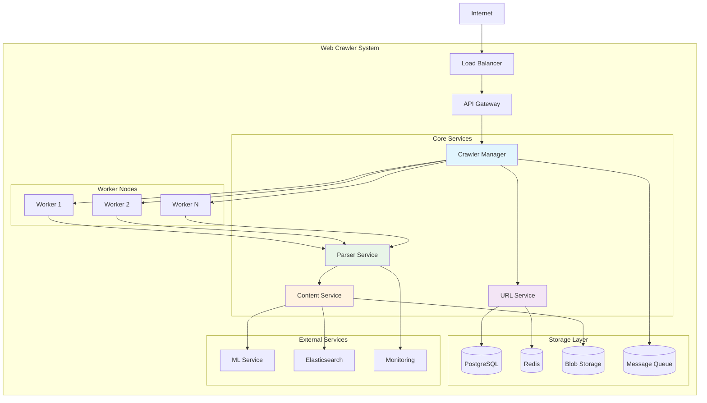
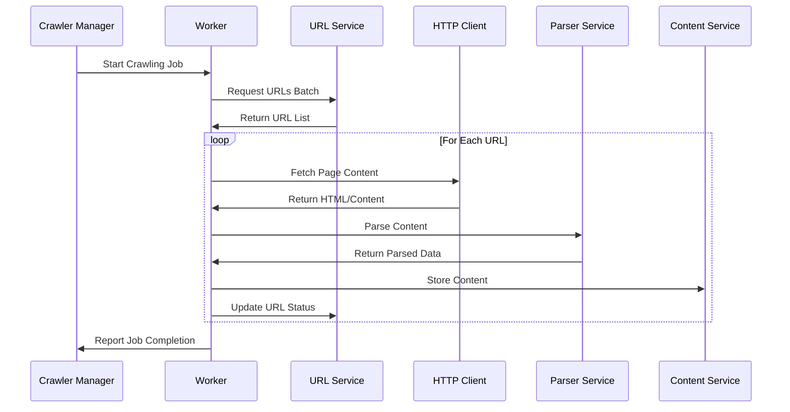

# Web Crawler - Low Level Design (Part 1: Core Architecture)

A comprehensive Low-Level Design for a scalable, distributed web crawler system capable of crawling billions of web pages efficiently while respecting robots.txt and implementing politeness policies.

## 🎯 System Overview

### Core Requirements
- **Scalability**: Handle billions of web pages
- **Politeness**: Respect robots.txt and implement delays
- **Fault Tolerance**: Handle failures gracefully
- **Duplicate Detection**: Avoid crawling same content
- **Priority Management**: Crawl important pages first
- **Real-time Processing**: Support incremental crawling

### High-Level Architecture


## 🏗️ Detailed Component Design

### 1. URL Management System

#### URL Model
```java
@Entity
@Table(name = "urls")
public class Url {
    @Id
    private String urlId;
    
    @Column(nullable = false, unique = true)
    private String url;
    
    @Enumerated(EnumType.STRING)
    private CrawlStatus status;
    
    @Column(name = "priority")
    private Integer priority;
    
    @Column(name = "depth")
    private Integer depth;
    
    @Column(name = "last_crawled")
    private LocalDateTime lastCrawled;
    
    @Column(name = "next_crawl_time")
    private LocalDateTime nextCrawlTime;
    
    @Column(name = "retry_count")
    private Integer retryCount;
    
    @Column(name = "domain")
    private String domain;
    
    @Column(name = "content_hash")
    private String contentHash;
    
    @Column(name = "created_at")
    private LocalDateTime createdAt;
    
    @Column(name = "updated_at")
    private LocalDateTime updatedAt;
    
    // Constructors, getters, setters
    public Url() {}
    
    public Url(String url, Integer priority, Integer depth) {
        this.urlId = generateUrlId(url);
        this.url = url;
        this.priority = priority;
        this.depth = depth;
        this.status = CrawlStatus.PENDING;
        this.retryCount = 0;
        this.createdAt = LocalDateTime.now();
        this.updatedAt = LocalDateTime.now();
        this.domain = extractDomain(url);
    }
    
    private String generateUrlId(String url) {
        return DigestUtils.sha256Hex(url);
    }
    
    private String extractDomain(String url) {
        try {
            URI uri = new URI(url);
            return uri.getHost();
        } catch (URISyntaxException e) {
            return "unknown";
        }
    }
}

enum CrawlStatus {
    PENDING, IN_PROGRESS, COMPLETED, FAILED, BLOCKED, DUPLICATE
}
```

#### URL Service Implementation
```java
@Service
@Transactional
public class UrlService {
    
    @Autowired
    private UrlRepository urlRepository;
    
    @Autowired
    private RedisTemplate<String, Object> redisTemplate;
    
    @Autowired
    private BloomFilter<String> urlBloomFilter;
    
    @Autowired
    private PolitenessManager politenessManager;
    
    private static final String URL_QUEUE_KEY = "url_queue:";
    private static final String URL_PROCESSING_KEY = "url_processing:";
    
    public void addUrls(List<String> urls, Integer priority, Integer depth) {
        List<Url> validUrls = new ArrayList<>();
        
        for (String urlStr : urls) {
            if (isValidUrl(urlStr) && !isDuplicate(urlStr)) {
                Url url = new Url(urlStr, priority, depth);
                validUrls.add(url);
                
                // Add to bloom filter for fast duplicate detection
                urlBloomFilter.put(urlStr);
                
                // Add to priority queue
                addToPriorityQueue(url);
            }
        }
        
        if (!validUrls.isEmpty()) {
            urlRepository.saveAll(validUrls);
        }
    }
    
    public List<Url> getUrlsForCrawling(String workerId, int batchSize) {
        List<Url> urls = new ArrayList<>();
        
        // Get URLs from priority queue considering politeness
        for (int i = 0; i < batchSize; i++) {
            Url url = getNextPoliteUrl(workerId);
            if (url != null) {
                url.setStatus(CrawlStatus.IN_PROGRESS);
                urls.add(url);
                
                // Mark as processing
                markAsProcessing(url, workerId);
            }
        }
        
        if (!urls.isEmpty()) {
            urlRepository.saveAll(urls);
        }
        
        return urls;
    }
    
    private Url getNextPoliteUrl(String workerId) {
        // Check different priority queues
        for (int priority = 1; priority <= 5; priority++) {
            String queueKey = URL_QUEUE_KEY + priority;
            
            while (true) {
                String urlData = (String) redisTemplate.opsForList()
                    .rightPop(queueKey, Duration.ofSeconds(1));
                
                if (urlData == null) break;
                
                Url url = parseUrlData(urlData);
                
                // Check politeness constraints
                if (politenessManager.canCrawlDomain(url.getDomain())) {
                    politenessManager.recordCrawlAttempt(url.getDomain());
                    return url;
                } else {
                    // Re-queue for later
                    addToPriorityQueue(url);
                }
            }
        }
        
        return null;
    }
    
    private boolean isDuplicate(String url) {
        // First check bloom filter (fast)
        if (!urlBloomFilter.mightContain(url)) {
            return false;
        }
        
        // Then check cache
        String cacheKey = "url_exists:" + DigestUtils.sha256Hex(url);
        Boolean exists = (Boolean) redisTemplate.opsForValue().get(cacheKey);
        
        if (exists != null) {
            return exists;
        }
        
        // Finally check database
        boolean duplicate = urlRepository.existsByUrl(url);
        
        // Cache the result
        redisTemplate.opsForValue().set(cacheKey, duplicate, Duration.ofHours(1));
        
        return duplicate;
    }
    
    private void addToPriorityQueue(Url url) {
        String queueKey = URL_QUEUE_KEY + url.getPriority();
        String urlData = serializeUrl(url);
        redisTemplate.opsForList().leftPush(queueKey, urlData);
    }
    
    private void markAsProcessing(Url url, String workerId) {
        String processingKey = URL_PROCESSING_KEY + workerId;
        redisTemplate.opsForSet().add(processingKey, url.getUrlId());
        redisTemplate.expire(processingKey, Duration.ofMinutes(30));
    }
    
    public void updateCrawlStatus(String urlId, CrawlStatus status, 
                                 String contentHash, List<String> extractedUrls) {
        Optional<Url> urlOpt = urlRepository.findByUrlId(urlId);
        
        if (urlOpt.isPresent()) {
            Url url = urlOpt.get();
            url.setStatus(status);
            url.setLastCrawled(LocalDateTime.now());
            url.setContentHash(contentHash);
            url.setUpdatedAt(LocalDateTime.now());
            
            if (status == CrawlStatus.COMPLETED) {
                calculateNextCrawlTime(url);
                
                // Add extracted URLs for crawling
                if (extractedUrls != null && !extractedUrls.isEmpty()) {
                    addUrls(extractedUrls, url.getPriority() + 1, url.getDepth() + 1);
                }
            } else if (status == CrawlStatus.FAILED) {
                handleFailedUrl(url);
            }
            
            urlRepository.save(url);
        }
    }
    
    private void calculateNextCrawlTime(Url url) {
        // Calculate next crawl time based on content change frequency
        Duration interval = Duration.ofDays(7); // Default weekly
        
        // Adjust based on domain popularity and change frequency
        if (isHighPriorityDomain(url.getDomain())) {
            interval = Duration.ofDays(1);
        } else if (isNewsWebsite(url.getDomain())) {
            interval = Duration.ofHours(6);
        }
        
        url.setNextCrawlTime(LocalDateTime.now().plus(interval));
    }
    
    private void handleFailedUrl(Url url) {
        url.setRetryCount(url.getRetryCount() + 1);
        
        if (url.getRetryCount() < 3) {
            // Schedule for retry with exponential backoff
            LocalDateTime retryTime = LocalDateTime.now()
                .plusMinutes((long) Math.pow(2, url.getRetryCount()) * 10);
            url.setNextCrawlTime(retryTime);
            url.setStatus(CrawlStatus.PENDING);
        }
    }
}
```

### 2. Politeness Manager

#### Implementation
```java
@Component
public class PolitenessManager {
    
    @Autowired
    private RedisTemplate<String, Object> redisTemplate;
    
    @Autowired
    private RobotsTxtCache robotsTxtCache;
    
    private static final String DOMAIN_LAST_CRAWL_KEY = "domain_last_crawl:";
    private static final String DOMAIN_CRAWL_COUNT_KEY = "domain_crawl_count:";
    private static final int DEFAULT_CRAWL_DELAY_SECONDS = 1;
    private static final int MAX_CONCURRENT_REQUESTS_PER_DOMAIN = 2;
    
    public boolean canCrawlDomain(String domain) {
        // Check robots.txt
        if (!robotsTxtCache.isAllowed(domain, "/")) {
            return false;
        }
        
        // Check time-based politeness
        if (!respectsCrawlDelay(domain)) {
            return false;
        }
        
        // Check concurrent request limit
        if (!respectsConcurrencyLimit(domain)) {
            return false;
        }
        
        return true;
    }
    
    public void recordCrawlAttempt(String domain) {
        String lastCrawlKey = DOMAIN_LAST_CRAWL_KEY + domain;
        String countKey = DOMAIN_CRAWL_COUNT_KEY + domain;
        
        long currentTime = System.currentTimeMillis();
        redisTemplate.opsForValue().set(lastCrawlKey, currentTime);
        redisTemplate.opsForValue().increment(countKey);
        redisTemplate.expire(countKey, Duration.ofMinutes(1));
    }
    
    private boolean respectsCrawlDelay(String domain) {
        String lastCrawlKey = DOMAIN_LAST_CRAWL_KEY + domain;
        Long lastCrawlTime = (Long) redisTemplate.opsForValue().get(lastCrawlKey);
        
        if (lastCrawlTime == null) {
            return true;
        }
        
        int crawlDelay = robotsTxtCache.getCrawlDelay(domain);
        if (crawlDelay == -1) {
            crawlDelay = DEFAULT_CRAWL_DELAY_SECONDS;
        }
        
        long timeSinceLastCrawl = System.currentTimeMillis() - lastCrawlTime;
        return timeSinceLastCrawl >= (crawlDelay * 1000);
    }
    
    private boolean respectsConcurrencyLimit(String domain) {
        String countKey = DOMAIN_CRAWL_COUNT_KEY + domain;
        Integer currentCount = (Integer) redisTemplate.opsForValue().get(countKey);
        
        if (currentCount == null) {
            currentCount = 0;
        }
        
        return currentCount < MAX_CONCURRENT_REQUESTS_PER_DOMAIN;
    }
}
```

### 3. Robots.txt Cache

#### Implementation
```java
@Component
public class RobotsTxtCache {
    
    @Autowired
    private RedisTemplate<String, Object> redisTemplate;
    
    @Autowired
    private WebClient webClient;
    
    private static final String ROBOTS_CACHE_KEY = "robots_txt:";
    private static final Duration CACHE_DURATION = Duration.ofHours(24);
    
    public boolean isAllowed(String domain, String path) {
        RobotsTxt robotsTxt = getRobotsTxt(domain);
        
        if (robotsTxt == null) {
            return true; // Allow if robots.txt not found
        }
        
        return robotsTxt.isAllowed("*", path);
    }
    
    public int getCrawlDelay(String domain) {
        RobotsTxt robotsTxt = getRobotsTxt(domain);
        
        if (robotsTxt != null) {
            return robotsTxt.getCrawlDelay("*");
        }
        
        return -1; // No specific delay
    }
    
    private RobotsTxt getRobotsTxt(String domain) {
        String cacheKey = ROBOTS_CACHE_KEY + domain;
        RobotsTxt cached = (RobotsTxt) redisTemplate.opsForValue().get(cacheKey);
        
        if (cached != null) {
            return cached;
        }
        
        // Fetch robots.txt
        try {
            String robotsUrl = "https://" + domain + "/robots.txt";
            String content = webClient.get()
                .uri(robotsUrl)
                .retrieve()
                .bodyToMono(String.class)
                .timeout(Duration.ofSeconds(5))
                .block();
            
            RobotsTxt robotsTxt = parseRobotsTxt(content);
            
            // Cache the result
            redisTemplate.opsForValue().set(cacheKey, robotsTxt, CACHE_DURATION);
            
            return robotsTxt;
            
        } catch (Exception e) {
            // Cache null result to avoid repeated failures
            redisTemplate.opsForValue().set(cacheKey, null, Duration.ofMinutes(30));
            return null;
        }
    }
    
    private RobotsTxt parseRobotsTxt(String content) {
        RobotsTxt robotsTxt = new RobotsTxt();
        
        String[] lines = content.split("\n");
        String currentUserAgent = null;
        
        for (String line : lines) {
            line = line.trim();
            
            if (line.startsWith("User-agent:")) {
                currentUserAgent = line.substring(11).trim();
            } else if (line.startsWith("Disallow:") && currentUserAgent != null) {
                String path = line.substring(9).trim();
                robotsTxt.addDisallowRule(currentUserAgent, path);
            } else if (line.startsWith("Allow:") && currentUserAgent != null) {
                String path = line.substring(6).trim();
                robotsTxt.addAllowRule(currentUserAgent, path);
            } else if (line.startsWith("Crawl-delay:") && currentUserAgent != null) {
                try {
                    int delay = Integer.parseInt(line.substring(12).trim());
                    robotsTxt.setCrawlDelay(currentUserAgent, delay);
                } catch (NumberFormatException e) {
                    // Ignore invalid delay
                }
            }
        }
        
        return robotsTxt;
    }
}

class RobotsTxt {
    private Map<String, List<String>> disallowRules = new HashMap<>();
    private Map<String, List<String>> allowRules = new HashMap<>();
    private Map<String, Integer> crawlDelays = new HashMap<>();
    
    public void addDisallowRule(String userAgent, String path) {
        disallowRules.computeIfAbsent(userAgent, k -> new ArrayList<>()).add(path);
    }
    
    public void addAllowRule(String userAgent, String path) {
        allowRules.computeIfAbsent(userAgent, k -> new ArrayList<>()).add(path);
    }
    
    public void setCrawlDelay(String userAgent, int delay) {
        crawlDelays.put(userAgent, delay);
    }
    
    public boolean isAllowed(String userAgent, String path) {
        // Check specific user agent rules first
        if (checkRules(userAgent, path)) {
            return true;
        }
        
        // Check wildcard rules
        return checkRules("*", path);
    }
    
    private boolean checkRules(String userAgent, String path) {
        List<String> disallowed = disallowRules.get(userAgent);
        List<String> allowed = allowRules.get(userAgent);
        
        // Check allow rules first (more specific)
        if (allowed != null) {
            for (String allowPattern : allowed) {
                if (path.startsWith(allowPattern)) {
                    return true;
                }
            }
        }
        
        // Check disallow rules
        if (disallowed != null) {
            for (String disallowPattern : disallowed) {
                if (path.startsWith(disallowPattern)) {
                    return false;
                }
            }
        }
        
        return true; // Default allow
    }
    
    public int getCrawlDelay(String userAgent) {
        Integer delay = crawlDelays.get(userAgent);
        if (delay != null) {
            return delay;
        }
        
        return crawlDelays.getOrDefault("*", -1);
    }
}
```

## 🔄 Crawler Worker Architecture

### Worker Component Flow


### Crawler Worker Implementation
```java
@Component
public class CrawlerWorker {
    
    @Autowired
    private UrlService urlService;
    
    @Autowired
    private HttpClientService httpClientService;
    
    @Autowired
    private ParserService parserService;
    
    @Autowired
    private ContentService contentService;
    
    @Autowired
    private PolitenessManager politenessManager;
    
    private final String workerId;
    private final ExecutorService executorService;
    private volatile boolean isRunning = false;
    
    public CrawlerWorker() {
        this.workerId = UUID.randomUUID().toString();
        this.executorService = Executors.newFixedThreadPool(10);
    }
    
    @PostConstruct
    public void startCrawling() {
        isRunning = true;
        
        // Start multiple crawler threads
        for (int i = 0; i < 5; i++) {
            executorService.submit(this::crawlWorkerLoop);
        }
    }
    
    @PreDestroy
    public void stopCrawling() {
        isRunning = false;
        executorService.shutdown();
        
        try {
            if (!executorService.awaitTermination(30, TimeUnit.SECONDS)) {
                executorService.shutdownNow();
            }
        } catch (InterruptedException e) {
            executorService.shutdownNow();
        }
    }
    
    private void crawlWorkerLoop() {
        while (isRunning) {
            try {
                // Get batch of URLs to crawl
                List<Url> urls = urlService.getUrlsForCrawling(workerId, 10);
                
                if (urls.isEmpty()) {
                    Thread.sleep(5000); // Wait if no URLs available
                    continue;
                }
                
                // Process URLs in parallel
                List<CompletableFuture<Void>> futures = urls.stream()
                    .map(url -> CompletableFuture.runAsync(() -> processUrl(url), executorService))
                    .collect(Collectors.toList());
                
                // Wait for all to complete
                CompletableFuture.allOf(futures.toArray(new CompletableFuture[0]))
                    .get(60, TimeUnit.SECONDS);
                    
            } catch (Exception e) {
                log.error("Error in crawler worker loop", e);
                
                try {
                    Thread.sleep(10000); // Back off on error
                } catch (InterruptedException ie) {
                    Thread.currentThread().interrupt();
                    break;
                }
            }
        }
    }
    
    private void processUrl(Url url) {
        String urlId = url.getUrlId();
        String urlString = url.getUrl();
        
        try {
            log.info("Crawling URL: {}", urlString);
            
            // Fetch page content
            CrawlResult result = httpClientService.fetchPage(urlString);
            
            if (result.isSuccessful()) {
                // Parse content
                ParsedContent parsed = parserService.parseContent(
                    urlString, result.getContent(), result.getContentType());
                
                // Store content
                String contentId = contentService.storeContent(
                    urlString, parsed.getContent(), parsed.getMetadata());
                
                // Calculate content hash for duplicate detection
                String contentHash = DigestUtils.sha256Hex(parsed.getContent());
                
                // Update URL status
                urlService.updateCrawlStatus(
                    urlId, 
                    CrawlStatus.COMPLETED, 
                    contentHash, 
                    parsed.getExtractedUrls()
                );
                
                log.info("Successfully crawled: {}", urlString);
                
            } else {
                handleCrawlFailure(urlId, result.getErrorMessage());
            }
            
        } catch (Exception e) {
            log.error("Error processing URL: " + urlString, e);
            handleCrawlFailure(urlId, e.getMessage());
        }
    }
    
    private void handleCrawlFailure(String urlId, String errorMessage) {
        urlService.updateCrawlStatus(urlId, CrawlStatus.FAILED, null, null);
        
        // Log failure for monitoring
        log.warn("Failed to crawl URL: {} - Error: {}", urlId, errorMessage);
    }
}
```

[Continue to Part 2: Advanced Components & Implementation →](./web-crawler-implementation.md)

---
[← Back to Main Guide](./README.md) | [Next: Web Crawler Implementation →](./web-crawler-implementation.md)

**Related Topics:**
- [Microservices Architecture](./microservices.md) - Service decomposition patterns
- [Message Queues](./message-queues.md) - Asynchronous processing
- [Caching Strategies](./caching-strategies.md) - Performance optimization
- [Rate Limiting](./rate-limiting.md) - Traffic control mechanisms