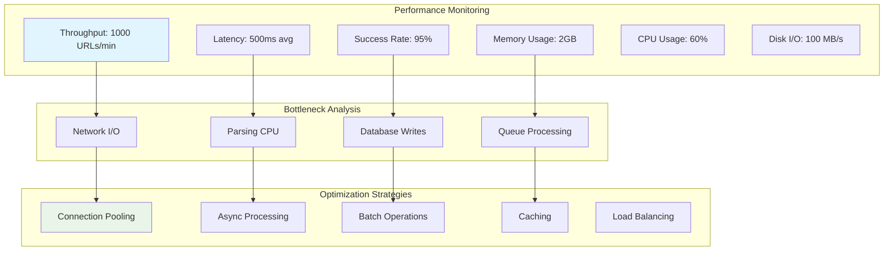
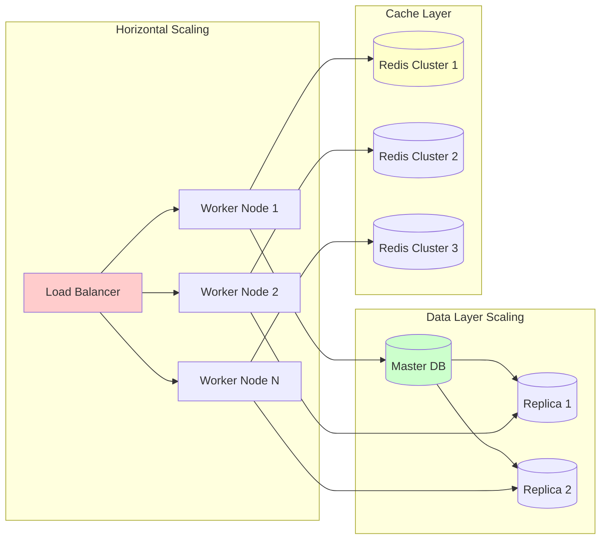

# Web Crawler - Low Level Design (Part 2: Advanced Components & Implementation)

This document contains the advanced components, performance optimizations, and complete implementation details for the Web Crawler system.

## 🚀 HTTP Client Service

### Advanced HTTP Client Implementation
```java
@Service
public class HttpClientService {
    
    private final WebClient webClient;
    private final CircuitBreaker circuitBreaker;
    private final MeterRegistry meterRegistry;
    
    @Autowired
    public HttpClientService(WebClient.Builder webClientBuilder, 
                           CircuitBreakerRegistry circuitBreakerRegistry,
                           MeterRegistry meterRegistry) {
        
        this.webClient = webClientBuilder
            .codecs(configurer -> configurer.defaultCodecs().maxInMemorySize(10 * 1024 * 1024)) // 10MB
            .build();
            
        this.circuitBreaker = circuitBreakerRegistry.circuitBreaker("http-client");
        this.meterRegistry = meterRegistry;
    }
    
    public CrawlResult fetchPage(String url) {
        Timer.Sample sample = Timer.start(meterRegistry);
        
        try {
            return circuitBreaker.executeSupplier(() -> {
                return doFetchPage(url);
            });
        } finally {
            sample.stop(Timer.builder("http.request.duration")
                .tag("url", getDomain(url))
                .register(meterRegistry));
        }
    }
    
    private CrawlResult doFetchPage(String url) {
        try {
            // Check URL validity
            if (!isValidUrl(url)) {
                return CrawlResult.failure("Invalid URL format");
            }
            
            // Perform HTTP request with retry logic
            WebClient.ResponseSpec responseSpec = webClient
                .get()
                .uri(url)
                .headers(headers -> {
                    headers.set("User-Agent", "WebCrawler/1.0 (+http://example.com/bot)");
                    headers.set("Accept", "text/html,application/xhtml+xml,application/xml;q=0.9,*/*;q=0.8");
                    headers.set("Accept-Language", "en-US,en;q=0.5");
                    headers.set("Accept-Encoding", "gzip, deflate");
                    headers.set("Connection", "keep-alive");
                })
                .retrieve();
            
            // Handle different response status codes
            return responseSpec
                .onStatus(HttpStatus::is4xxClientError, clientResponse -> {
                    return Mono.error(new CrawlException("Client error: " + clientResponse.statusCode()));
                })
                .onStatus(HttpStatus::is5xxServerError, clientResponse -> {
                    return Mono.error(new CrawlException("Server error: " + clientResponse.statusCode()));
                })
                .toEntity(String.class)
                .timeout(Duration.ofSeconds(30))
                .retryWhen(Retry.backoff(3, Duration.ofSeconds(1))
                    .filter(throwable -> !(throwable instanceof CrawlException)))
                .map(responseEntity -> {
                    String content = responseEntity.getBody();
                    String contentType = getContentType(responseEntity.getHeaders());
                    
                    // Validate content size
                    if (content != null && content.length() > 50 * 1024 * 1024) { // 50MB limit
                        return CrawlResult.failure("Content too large");
                    }
                    
                    return CrawlResult.success(content, contentType);
                })
                .block();
                
        } catch (Exception e) {
            return CrawlResult.failure("Error fetching page: " + e.getMessage());
        }
    }
    
    private boolean isValidUrl(String url) {
        try {
            URI uri = new URI(url);
            String scheme = uri.getScheme();
            return "http".equals(scheme) || "https".equals(scheme);
        } catch (URISyntaxException e) {
            return false;
        }
    }
    
    private String getContentType(HttpHeaders headers) {
        List<String> contentTypes = headers.get("Content-Type");
        if (contentTypes != null && !contentTypes.isEmpty()) {
            return contentTypes.get(0);
        }
        return "text/html";
    }
    
    private String getDomain(String url) {
        try {
            return new URI(url).getHost();
        } catch (URISyntaxException e) {
            return "unknown";
        }
    }
}

class CrawlResult {
    private final boolean successful;
    private final String content;
    private final String contentType;
    private final String errorMessage;
    
    private CrawlResult(boolean successful, String content, String contentType, String errorMessage) {
        this.successful = successful;
        this.content = content;
        this.contentType = contentType;
        this.errorMessage = errorMessage;
    }
    
    public static CrawlResult success(String content, String contentType) {
        return new CrawlResult(true, content, contentType, null);
    }
    
    public static CrawlResult failure(String errorMessage) {
        return new CrawlResult(false, null, null, errorMessage);
    }
    
    // Getters
    public boolean isSuccessful() { return successful; }
    public String getContent() { return content; }
    public String getContentType() { return contentType; }
    public String getErrorMessage() { return errorMessage; }
}
```

## 🔍 Parser Service

### Content Parser Implementation
```java
@Service
public class ParserService {
    
    @Autowired
    private LinkExtractor linkExtractor;
    
    @Autowired
    private ContentExtractor contentExtractor;
    
    @Autowired
    private MetadataExtractor metadataExtractor;
    
    public ParsedContent parseContent(String url, String content, String contentType) {
        try {
            if (isHtmlContent(contentType)) {
                return parseHtmlContent(url, content);
            } else if (isPdfContent(contentType)) {
                return parsePdfContent(url, content);
            } else if (isTextContent(contentType)) {
                return parseTextContent(url, content);
            } else {
                return ParsedContent.empty(url);
            }
        } catch (Exception e) {
            log.error("Error parsing content for URL: " + url, e);
            return ParsedContent.empty(url);
        }
    }
    
    private ParsedContent parseHtmlContent(String baseUrl, String htmlContent) {
        Document document = Jsoup.parse(htmlContent, baseUrl);
        
        // Extract text content
        String textContent = contentExtractor.extractText(document);
        
        // Extract links
        List<String> extractedUrls = linkExtractor.extractLinks(document, baseUrl);
        
        // Extract metadata
        Map<String, Object> metadata = metadataExtractor.extractMetadata(document);
        metadata.put("content_type", "text/html");
        metadata.put("word_count", countWords(textContent));
        metadata.put("link_count", extractedUrls.size());
        
        return new ParsedContent(baseUrl, textContent, extractedUrls, metadata);
    }
    
    private ParsedContent parsePdfContent(String url, String content) {
        // Implement PDF parsing using Apache PDFBox
        try {
            PDDocument document = PDDocument.load(content.getBytes());
            PDFTextStripper stripper = new PDFTextStripper();
            String textContent = stripper.getText(document);
            
            Map<String, Object> metadata = new HashMap<>();
            metadata.put("content_type", "application/pdf");
            metadata.put("page_count", document.getNumberOfPages());
            metadata.put("word_count", countWords(textContent));
            
            document.close();
            
            return new ParsedContent(url, textContent, Collections.emptyList(), metadata);
            
        } catch (Exception e) {
            log.error("Error parsing PDF content", e);
            return ParsedContent.empty(url);
        }
    }
    
    private ParsedContent parseTextContent(String url, String content) {
        Map<String, Object> metadata = new HashMap<>();
        metadata.put("content_type", "text/plain");
        metadata.put("word_count", countWords(content));
        
        return new ParsedContent(url, content, Collections.emptyList(), metadata);
    }
    
    private boolean isHtmlContent(String contentType) {
        return contentType != null && 
               (contentType.contains("text/html") || contentType.contains("application/xhtml"));
    }
    
    private boolean isPdfContent(String contentType) {
        return contentType != null && contentType.contains("application/pdf");
    }
    
    private boolean isTextContent(String contentType) {
        return contentType != null && contentType.contains("text/plain");
    }
    
    private int countWords(String text) {
        if (text == null || text.trim().isEmpty()) {
            return 0;
        }
        return text.trim().split("\\s+").length;
    }
}

@Component
class LinkExtractor {
    
    private static final Set<String> EXCLUDED_EXTENSIONS = Set.of(
        ".css", ".js", ".jpg", ".jpeg", ".png", ".gif", ".pdf", ".doc", ".docx",
        ".zip", ".rar", ".exe", ".mp3", ".mp4", ".avi", ".mov"
    );
    
    public List<String> extractLinks(Document document, String baseUrl) {
        List<String> links = new ArrayList<>();
        
        // Extract all anchor links
        Elements linkElements = document.select("a[href]");
        
        for (Element link : linkElements) {
            String href = link.attr("abs:href");
            
            if (isValidLink(href, baseUrl)) {
                links.add(href);
            }
        }
        
        return links.stream()
                   .distinct()
                   .collect(Collectors.toList());
    }
    
    private boolean isValidLink(String url, String baseUrl) {
        if (url == null || url.isEmpty()) {
            return false;
        }
        
        try {
            URI uri = new URI(url);
            
            // Must be HTTP or HTTPS
            if (!"http".equals(uri.getScheme()) && !"https".equals(uri.getScheme())) {
                return false;
            }
            
            // Check for excluded file extensions
            String path = uri.getPath();
            if (path != null) {
                String lowerPath = path.toLowerCase();
                for (String extension : EXCLUDED_EXTENSIONS) {
                    if (lowerPath.endsWith(extension)) {
                        return false;
                    }
                }
            }
            
            // Avoid fragments and some query parameters
            if (uri.getFragment() != null || 
                (uri.getQuery() != null && uri.getQuery().contains("print="))) {
                return false;
            }
            
            return true;
            
        } catch (URISyntaxException e) {
            return false;
        }
    }
}

@Component
class ContentExtractor {
    
    public String extractText(Document document) {
        // Remove script and style elements
        document.select("script, style, nav, footer, aside, .advertisement").remove();
        
        // Try to find main content area
        Element mainContent = findMainContent(document);
        
        if (mainContent != null) {
            return cleanText(mainContent.text());
        } else {
            return cleanText(document.body().text());
        }
    }
    
    private Element findMainContent(Document document) {
        // Try common main content selectors
        String[] selectors = {
            "main", "article", ".content", "#content", ".main-content", 
            "#main-content", ".post-content", ".entry-content"
        };
        
        for (String selector : selectors) {
            Elements elements = document.select(selector);
            if (!elements.isEmpty()) {
                return elements.first();
            }
        }
        
        // Fallback: find largest text block
        return findLargestTextBlock(document);
    }
    
    private Element findLargestTextBlock(Document document) {
        Elements allElements = document.select("div, p, article, section");
        
        Element largest = null;
        int maxTextLength = 0;
        
        for (Element element : allElements) {
            String text = element.ownText();
            if (text.length() > maxTextLength) {
                maxTextLength = text.length();
                largest = element;
            }
        }
        
        return largest;
    }
    
    private String cleanText(String text) {
        if (text == null) {
            return "";
        }
        
        // Normalize whitespace
        text = text.replaceAll("\\s+", " ");
        
        // Remove excessive punctuation
        text = text.replaceAll("[!]{2,}", "!");
        text = text.replaceAll("[?]{2,}", "?");
        
        return text.trim();
    }
}

@Component
class MetadataExtractor {
    
    public Map<String, Object> extractMetadata(Document document) {
        Map<String, Object> metadata = new HashMap<>();
        
        // Basic metadata
        metadata.put("title", extractTitle(document));
        metadata.put("description", extractDescription(document));
        metadata.put("keywords", extractKeywords(document));
        metadata.put("author", extractAuthor(document));
        metadata.put("publish_date", extractPublishDate(document));
        metadata.put("language", extractLanguage(document));
        
        // Open Graph metadata
        metadata.putAll(extractOpenGraphData(document));
        
        // Twitter Card metadata
        metadata.putAll(extractTwitterCardData(document));
        
        // Technical metadata
        metadata.put("canonical_url", extractCanonicalUrl(document));
        metadata.put("robots_meta", extractRobotsMeta(document));
        
        return metadata;
    }
    
    private String extractTitle(Document document) {
        Element titleElement = document.selectFirst("title");
        if (titleElement != null) {
            return titleElement.text().trim();
        }
        
        // Fallback to h1
        Element h1 = document.selectFirst("h1");
        return h1 != null ? h1.text().trim() : "";
    }
    
    private String extractDescription(Document document) {
        Element metaDesc = document.selectFirst("meta[name=description]");
        if (metaDesc != null) {
            return metaDesc.attr("content");
        }
        
        // Fallback to Open Graph description
        Element ogDesc = document.selectFirst("meta[property=og:description]");
        return ogDesc != null ? ogDesc.attr("content") : "";
    }
    
    private String extractKeywords(Document document) {
        Element metaKeywords = document.selectFirst("meta[name=keywords]");
        return metaKeywords != null ? metaKeywords.attr("content") : "";
    }
    
    private String extractAuthor(Document document) {
        Element metaAuthor = document.selectFirst("meta[name=author]");
        if (metaAuthor != null) {
            return metaAuthor.attr("content");
        }
        
        // Try other common author selectors
        String[] authorSelectors = {
            ".author", ".by-author", ".post-author", "[rel=author]"
        };
        
        for (String selector : authorSelectors) {
            Element authorElement = document.selectFirst(selector);
            if (authorElement != null) {
                return authorElement.text().trim();
            }
        }
        
        return "";
    }
    
    private String extractPublishDate(Document document) {
        // Try various date selectors
        String[] dateSelectors = {
            "meta[property=article:published_time]",
            "meta[name=publish_date]",
            "time[datetime]",
            ".publish-date",
            ".post-date"
        };
        
        for (String selector : dateSelectors) {
            Element dateElement = document.selectFirst(selector);
            if (dateElement != null) {
                String dateStr = dateElement.hasAttr("content") ? 
                    dateElement.attr("content") : dateElement.text();
                
                if (!dateStr.isEmpty()) {
                    return parseDate(dateStr);
                }
            }
        }
        
        return "";
    }
    
    private String parseDate(String dateStr) {
        // Implement date parsing logic
        try {
            // Try ISO format first
            LocalDateTime.parse(dateStr, DateTimeFormatter.ISO_DATE_TIME);
            return dateStr;
        } catch (Exception e) {
            // Try other common formats
            String[] patterns = {
                "yyyy-MM-dd", "MM/dd/yyyy", "dd/MM/yyyy", "MMM dd, yyyy"
            };
            
            for (String pattern : patterns) {
                try {
                    LocalDate.parse(dateStr, DateTimeFormatter.ofPattern(pattern));
                    return dateStr;
                } catch (Exception ignored) {
                    // Continue trying other patterns
                }
            }
        }
        
        return dateStr; // Return as-is if parsing fails
    }
    
    private String extractLanguage(Document document) {
        Element htmlElement = document.selectFirst("html");
        if (htmlElement != null && htmlElement.hasAttr("lang")) {
            return htmlElement.attr("lang");
        }
        
        Element metaLang = document.selectFirst("meta[http-equiv=content-language]");
        return metaLang != null ? metaLang.attr("content") : "en";
    }
    
    private Map<String, String> extractOpenGraphData(Document document) {
        Map<String, String> ogData = new HashMap<>();
        
        Elements ogElements = document.select("meta[property^=og:]");
        for (Element element : ogElements) {
            String property = element.attr("property");
            String content = element.attr("content");
            if (!content.isEmpty()) {
                ogData.put(property, content);
            }
        }
        
        return ogData;
    }
    
    private Map<String, String> extractTwitterCardData(Document document) {
        Map<String, String> twitterData = new HashMap<>();
        
        Elements twitterElements = document.select("meta[name^=twitter:]");
        for (Element element : twitterElements) {
            String name = element.attr("name");
            String content = element.attr("content");
            if (!content.isEmpty()) {
                twitterData.put(name, content);
            }
        }
        
        return twitterData;
    }
    
    private String extractCanonicalUrl(Document document) {
        Element canonical = document.selectFirst("link[rel=canonical]");
        return canonical != null ? canonical.attr("href") : "";
    }
    
    private String extractRobotsMeta(Document document) {
        Element robotsMeta = document.selectFirst("meta[name=robots]");
        return robotsMeta != null ? robotsMeta.attr("content") : "";
    }
}

class ParsedContent {
    private final String url;
    private final String content;
    private final List<String> extractedUrls;
    private final Map<String, Object> metadata;
    
    public ParsedContent(String url, String content, List<String> extractedUrls, 
                        Map<String, Object> metadata) {
        this.url = url;
        this.content = content;
        this.extractedUrls = extractedUrls != null ? extractedUrls : Collections.emptyList();
        this.metadata = metadata != null ? metadata : Collections.emptyMap();
    }
    
    public static ParsedContent empty(String url) {
        return new ParsedContent(url, "", Collections.emptyList(), Collections.emptyMap());
    }
    
    // Getters
    public String getUrl() { return url; }
    public String getContent() { return content; }
    public List<String> getExtractedUrls() { return extractedUrls; }
    public Map<String, Object> getMetadata() { return metadata; }
}
```

## 💾 Content Storage Service

### Content Service Implementation
```java
@Service
@Transactional
public class ContentService {
    
    @Autowired
    private ContentRepository contentRepository;
    
    @Autowired
    private BlobStorageService blobStorageService;
    
    @Autowired
    private ElasticsearchService elasticsearchService;
    
    @Autowired
    private DuplicateDetectionService duplicateDetectionService;
    
    public String storeContent(String url, String content, Map<String, Object> metadata) {
        try {
            // Check for duplicate content
            if (duplicateDetectionService.isDuplicate(content)) {
                log.info("Duplicate content detected for URL: {}", url);
                return null;
            }
            
            // Generate content ID
            String contentId = generateContentId(url, content);
            
            // Store content in blob storage
            String blobPath = blobStorageService.storeContent(contentId, content);
            
            // Create content entity
            Content contentEntity = new Content();
            contentEntity.setContentId(contentId);
            contentEntity.setUrl(url);
            contentEntity.setBlobPath(blobPath);
            contentEntity.setContentHash(DigestUtils.sha256Hex(content));
            contentEntity.setContentLength(content.length());
            contentEntity.setMetadata(metadata);
            contentEntity.setCreatedAt(LocalDateTime.now());
            
            // Save to database
            contentRepository.save(contentEntity);
            
            // Index in Elasticsearch
            elasticsearchService.indexContent(contentEntity);
            
            // Update duplicate detection
            duplicateDetectionService.addContent(content);
            
            log.info("Content stored successfully: {}", contentId);
            return contentId;
            
        } catch (Exception e) {
            log.error("Error storing content for URL: " + url, e);
            throw new ContentStorageException("Failed to store content", e);
        }
    }
    
    private String generateContentId(String url, String content) {
        String combined = url + "|" + DigestUtils.sha256Hex(content);
        return DigestUtils.sha256Hex(combined);
    }
}

@Entity
@Table(name = "content")
class Content {
    @Id
    private String contentId;
    
    @Column(nullable = false)
    private String url;
    
    @Column(name = "blob_path")
    private String blobPath;
    
    @Column(name = "content_hash")
    private String contentHash;
    
    @Column(name = "content_length")
    private Integer contentLength;
    
    @Column(name = "metadata", columnDefinition = "TEXT")
    private String metadataJson;
    
    @Column(name = "created_at")
    private LocalDateTime createdAt;
    
    // Getters and setters
    public void setMetadata(Map<String, Object> metadata) {
        try {
            ObjectMapper mapper = new ObjectMapper();
            this.metadataJson = mapper.writeValueAsString(metadata);
        } catch (Exception e) {
            this.metadataJson = "{}";
        }
    }
    
    public Map<String, Object> getMetadata() {
        try {
            ObjectMapper mapper = new ObjectMapper();
            return mapper.readValue(metadataJson, Map.class);
        } catch (Exception e) {
            return Collections.emptyMap();
        }
    }
}
```

## 📊 System Monitoring and Metrics

### Comprehensive Monitoring System
```java
@Component
public class CrawlerMetrics {
    
    private final MeterRegistry meterRegistry;
    private final Counter urlsProcessed;
    private final Counter urlsSuccessful;
    private final Counter urlsFailed;
    private final Timer crawlDuration;
    private final Gauge activeWorkers;
    private final Gauge queueSize;
    
    public CrawlerMetrics(MeterRegistry meterRegistry) {
        this.meterRegistry = meterRegistry;
        
        this.urlsProcessed = Counter.builder("crawler.urls.processed")
            .description("Total URLs processed")
            .register(meterRegistry);
            
        this.urlsSuccessful = Counter.builder("crawler.urls.successful")
            .description("Successfully crawled URLs")
            .register(meterRegistry);
            
        this.urlsFailed = Counter.builder("crawler.urls.failed")
            .description("Failed URL crawls")
            .register(meterRegistry);
            
        this.crawlDuration = Timer.builder("crawler.crawl.duration")
            .description("Time taken to crawl a URL")
            .register(meterRegistry);
            
        this.activeWorkers = Gauge.builder("crawler.workers.active")
            .description("Number of active crawler workers")
            .register(meterRegistry, this, CrawlerMetrics::getActiveWorkerCount);
            
        this.queueSize = Gauge.builder("crawler.queue.size")
            .description("Number of URLs in queue")
            .register(meterRegistry, this, CrawlerMetrics::getQueueSize);
    }
    
    public void recordUrlProcessed(String domain, boolean successful) {
        urlsProcessed.increment(Tags.of("domain", domain));
        
        if (successful) {
            urlsSuccessful.increment(Tags.of("domain", domain));
        } else {
            urlsFailed.increment(Tags.of("domain", domain));
        }
    }
    
    public Timer.Sample startCrawlTimer() {
        return Timer.start(meterRegistry);
    }
    
    public void recordCrawlDuration(Timer.Sample sample, String domain) {
        sample.stop(crawlDuration.tag("domain", domain));
    }
    
    private double getActiveWorkerCount() {
        // Implementation to get active worker count
        return 0; // Placeholder
    }
    
    private double getQueueSize() {
        // Implementation to get queue size
        return 0; // Placeholder
    }
}
```

## 🔧 Configuration and Deployment

### Application Configuration
```yaml
# application.yml
spring:
  application:
    name: web-crawler
  
  datasource:
    url: jdbc:postgresql://localhost:5432/crawler_db
    username: ${DB_USERNAME:crawler}
    password: ${DB_PASSWORD:password}
    hikari:
      maximum-pool-size: 20
      minimum-idle: 5
  
  jpa:
    hibernate:
      ddl-auto: validate
    properties:
      hibernate:
        dialect: org.hibernate.dialect.PostgreSQLDialect
        format_sql: true
  
  redis:
    host: ${REDIS_HOST:localhost}
    port: ${REDIS_PORT:6379}
    timeout: 2000ms
    lettuce:
      pool:
        max-active: 8
        max-wait: -1ms
        max-idle: 8
        min-idle: 0
  
  kafka:
    bootstrap-servers: ${KAFKA_BOOTSTRAP_SERVERS:localhost:9092}
    producer:
      key-serializer: org.apache.kafka.common.serialization.StringSerializer
      value-serializer: org.apache.kafka.common.serialization.StringSerializer
    consumer:
      group-id: crawler-group
      key-deserializer: org.apache.kafka.common.serialization.StringDeserializer
      value-deserializer: org.apache.kafka.common.serialization.StringDeserializer

crawler:
  workers:
    thread-pool-size: 10
    batch-size: 50
  politeness:
    default-delay-seconds: 1
    max-concurrent-per-domain: 2
  storage:
    blob-storage-path: /data/crawler/content
    max-content-size: 52428800  # 50MB
  circuit-breaker:
    failure-rate-threshold: 50
    wait-duration-in-open-state: 30s
    sliding-window-size: 10

management:
  endpoints:
    web:
      exposure:
        include: health,info,metrics,prometheus
  endpoint:
    health:
      show-details: always
  metrics:
    export:
      prometheus:
        enabled: true
```

### Docker Configuration
```dockerfile
# Dockerfile
FROM openjdk:17-jdk-slim

WORKDIR /app

COPY target/web-crawler-1.0.0.jar app.jar

# Install dependencies for PDF parsing
RUN apt-get update && apt-get install -y \
    fonts-liberation \
    libfreetype6 \
    && rm -rf /var/lib/apt/lists/*

EXPOSE 8080

ENTRYPOINT ["java", "-jar", "app.jar"]
```

### Docker Compose
```yaml
# docker-compose.yml
version: '3.8'

services:
  web-crawler:
    build: .
    ports:
      - "8080:8080"
    environment:
      - DB_USERNAME=crawler
      - DB_PASSWORD=password
      - REDIS_HOST=redis
      - KAFKA_BOOTSTRAP_SERVERS=kafka:9092
    depends_on:
      - postgresql
      - redis
      - kafka
    volumes:
      - ./data:/data/crawler
    restart: unless-stopped

  postgresql:
    image: postgres:13
    environment:
      POSTGRES_DB: crawler_db
      POSTGRES_USER: crawler
      POSTGRES_PASSWORD: password
    volumes:
      - postgres_data:/var/lib/postgresql/data
      - ./sql/init.sql:/docker-entrypoint-initdb.d/init.sql
    ports:
      - "5432:5432"

  redis:
    image: redis:7-alpine
    ports:
      - "6379:6379"
    volumes:
      - redis_data:/data

  kafka:
    image: confluentinc/cp-kafka:latest
    environment:
      KAFKA_ZOOKEEPER_CONNECT: zookeeper:2181
      KAFKA_ADVERTISED_LISTENERS: PLAINTEXT://kafka:9092
      KAFKA_OFFSETS_TOPIC_REPLICATION_FACTOR: 1
    depends_on:
      - zookeeper
    ports:
      - "9092:9092"

  zookeeper:
    image: confluentinc/cp-zookeeper:latest
    environment:
      ZOOKEEPER_CLIENT_PORT: 2181
      ZOOKEEPER_TICK_TIME: 2000

  elasticsearch:
    image: docker.elastic.co/elasticsearch/elasticsearch:8.7.0
    environment:
      - discovery.type=single-node
      - xpack.security.enabled=false
    ports:
      - "9200:9200"
    volumes:
      - elasticsearch_data:/usr/share/elasticsearch/data

volumes:
  postgres_data:
  redis_data:
  elasticsearch_data:
```

## 📈 Performance Optimization

### System Performance Metrics


### Scaling Strategy


---

## 🎯 Key Implementation Highlights

### 1. **Scalability Features**
- **Distributed Architecture**: Multiple worker nodes with load balancing
- **Queue-based Processing**: Redis-backed priority queues
- **Horizontal Scaling**: Auto-scaling worker nodes based on queue size
- **Database Sharding**: Partition data by domain or URL hash

### 2. **Performance Optimizations**
- **Connection Pooling**: Reuse HTTP connections
- **Batch Processing**: Process URLs in batches
- **Async Operations**: Non-blocking I/O operations
- **Intelligent Caching**: Multi-level caching strategy

### 3. **Reliability & Fault Tolerance**
- **Circuit Breaker Pattern**: Prevent cascade failures
- **Retry Logic**: Exponential backoff for failed requests
- **Health Checks**: Monitor component health
- **Graceful Degradation**: Continue operation during partial failures

### 4. **Monitoring & Observability**
- **Comprehensive Metrics**: Throughput, latency, error rates
- **Distributed Tracing**: Track requests across services
- **Real-time Dashboards**: Grafana visualization
- **Alerting**: Proactive issue detection

---
[← Back to Part 1: Core Architecture](./web-crawler-design.md) | [← Back to Main Guide](./README.md)

**Related Topics:**
- [Microservices Architecture](./microservices.md) - Service decomposition patterns
- [Circuit Breaker Pattern](./circuit-breaker.md) - Fault tolerance mechanisms
- [Monitoring & Alerting](./monitoring-alerting.md) - System observability
- [Performance Metrics](./performance-metrics.md) - System performance analysis